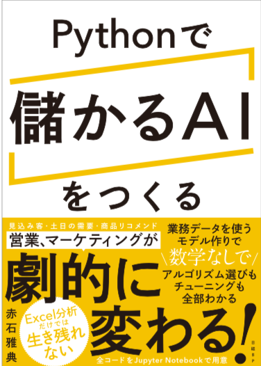

# 書籍「儲かるAI」補足情報

<!---
  [Amazonへのリンク](https://www.amazon.co.jp/dp/4296102508/)
-->  

***

当サイトは、書籍「儲かるAI」用の補足情報公開用のサイトとなります。  
Notebookファイルのダウンロードをしたい場合は、「**Notebookファイル一括ダウンロード手順**」に従ってまとめてダウンロードした後、ZIPファイルを解凍して下さい。  

* [Notebookファイル一括ダウンロード手順](download.md)

* [補足資料目次](docs/補足資料目次.md)

<!---
* [個別Notebookファイル](notebooks.md)
-->  

<!---
* [Notebook補足情報](notebook-ref.md)
-->  

* [正誤訂正](errors.md)

* [FAQ](faqs.md)

***
### リンク集

<!---
(Amazon) [Amazonレビュー](https://www.amazon.co.jp/product-reviews/4296102508/ref=acr_dpproductdetail_text?ie=UTF8&showViewpoints=1) 
-->  

<!---
(読書メーター) [読書メーター 感想・レビュー](https://bookmeter.com/books/13706684)
-->  

<!---
(ハイブリッド型総合書店 honto) [hontoレビュー](https://honto.jp/netstore/pd-review_0629564342_191.html)
-->  

(著者twitterアカウント) [@makaishi2](https://twitter.com/makaishi2)  
(注)著者は原則twitterではつぶやきませんが、書籍に関連したつぶやきをretweetで紹介しています  

(著者紹介記事) [AI関連書籍三冊目を出版したIBM赤石雅典に聞く「AIと仕事と執筆」](https://www.ibm.com/blogs/solutions/jp-ja/data_science_and_ai_akaishi-san/)  
勤務先のIBMのブログで紹介されました。

***
