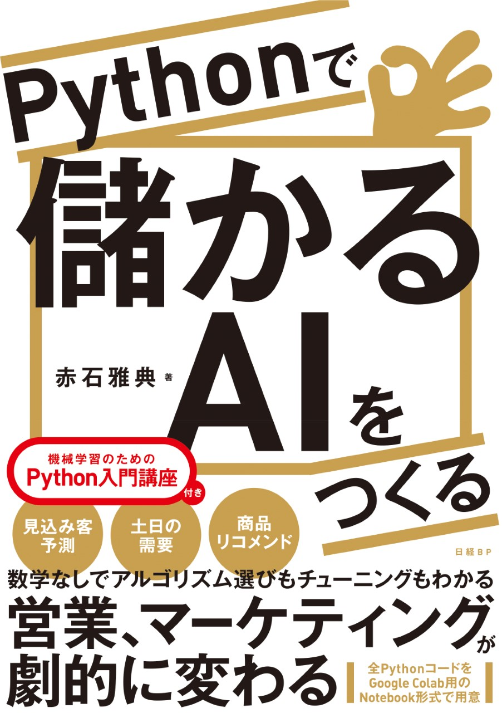

# 書籍「Pythonで儲かるAIをつくる」サポートサイト

#### Amazonへのリンク
[単行本](https://www.amazon.co.jp/dp/4296106961/)  
[Kindle](https://www.amazon.co.jp/dp/B08F9P726T/)  

　当サイトは、書籍「Pythonで儲かるAIをつくる」のサポートサイトです。  
　
## 実習用Notebook
 
　本書の実習用Notebookファイルは、下の「**Notebookファイル一括ダウンロード手順**」に従ってまとめてダウンロードして下さい。なお、本書のNotebookはすべて米Google社の「Google Colaboratory」で動かすことを前提にしています。    

* [Notebookファイル一括ダウンロード手順](refs/download.md)  
 
* [個別Notebookファイル](refs/notebooks.md)

* [Google Colaboratory](https://colab.research.google.com/notebooks/welcome.ipynb?hl=ja)

　下の手順に従えば、Notebookをダウンロードすることなく、いきなり動かすことも可能です。個々のファイルがどのような実習内容かについては、[個別Notebookファイル](refs/notebooks.md)を参考にして下さい。

* [実習NotebookをGoogle Colabで動かす方法](https://qiita.com/makaishi2/items/25529634aac508dcd6b0)

## 内容紹介

見込み客、土日の需要、商品リコメンド… 
営業、マーケティングが劇的に変わる 
業務に本当に役立つ“儲かるAI”を自分で作る！

* 数学なしでアルゴリズム選びもチューニングもわかる 
* 現場目線でAIの最適化までできる 
* ブラウザだけで試せるPython実習（Google Colab） 
* XGBoost、Prophetなど話題のAI技術を活用 
* 全PythonコードをGoogle Colab用のNotebook形式で用意 
＜機械学習のための \UTF{2003} Python入門講座＞つき！ 

業務に本当に役立つ“儲かるAI”を作るには 
「業務目線」と「技術目線」の両方が必要です。 

業務の課題を認識し、どう改善するかという「業務目線」が必要なのは 
従来システムと同じですが、AIの構築ではさらに 
業務の課題が本当に AIで解決できるのか、AIのどの処理方式なら適用できそうか 
という「技術目線」が不可欠なのです。 

本書のPython実習で学ぶことで、「AIの目利きができる技術目線」を獲得し 
自分でもAIを作れるようになります。 

1章 業務と機械学習プロジェクト  
2章 機械学習モデルの処理パターン   
3章 機械学習モデルの開発手順  
4章 機械学習モデル開発の重要ポイント   
5章 業務要件と処理パターン  
・営業成約予測（分類）  
・天候による売り上げ予測（回帰）   
・季節などの周期性で売り上げ予測（時系列分析）   
・お薦め商品の提案（アソシエーション分析）  
・顧客層に応じた販売戦略（クラスタリング、次元圧縮）   
6章 AIプロジェクトを成功させる上流工程のツボ  

詳細な目次リンクは、以下になります。  

* [書籍目次](refs/index.md)

## 追加事例やPython入門講座
本書の中で紹介できなかった2つの事例に基づく実習や、Pythonの入門講座を公開しています。それらを読んでいただければ、本書のイメージがわかるはずです(下の補足資料目次参照)。

* [補足資料目次](docs/補足資料目次.md)  

***
## リンク集

### 著者発信の情報

|ソース  |タイトルとリンク  |補足|
|---|---|---|
|qitta|[最短コースで機械学習を学べる　書籍「Pythonで儲かるAIをつくる」紹介](https://qiita.com/makaishi2/items/47e9afc3162bfd9c3c3c)|本書の特徴を著者自らが解説しています。|
|qitta|[Prophetでコロナ陽性者予測をしよう](https://qiita.com/makaishi2/items/aa88ccdc87af3e45edd7)|本書5.3節でProphetを用いた時系列予測の紹介をしていますが、その応用事例として実データを使ったコロナ陽性者予測をしています。|
|qitta|[Pythonでアソシエーション分析](https://qiita.com/makaishi2/items/c5f06f844cdb8454b6c3)|本書5.4節では(scikit-learnに該当ライブラリがないため)mlextendを使いアソシエーション分析を行っています。その実装面のポイントを抽出して記事にしました。|
|qitta|[「Pythonで儲かるAIをつくる」実装補足](https://qiita.com/makaishi2/items/cf0895bce50374bbb2ca)|ライブラリのバージョンアップ等の理由で、本書で説明されている実装をよりシンプルにできるケースを紹介しています。|
|qitta|[Pythonによる決定境界表示](https://qiita.com/makaishi2/items/2d0dd015ac1cbd86dd3f)|4.3節で利用している決定境界表示関数のプログラミングに関する解説です。|
|qitta|[AutoAIでお手軽機械学習(その1) 準備編](https://qiita.com/makaishi2/items/d63f0bbac32a975c391e)|本書最後のコラム(p.328)では AutpoMLと呼ばれるモデル構築自動化ツールの一例として IBM Cloud上のサービスであるAutoAIを紹介しています。このコラムの内容は、左の記事に始まる一連のリンクの手順で読者も自ら試すことができます。|
|speakerdeck|[データサイエンティストに必要なスキルと、分析プロジェクトを成功させるための上流工程のポイント](https://bit.ly/3gcFCJL)|2021年12月にSFC データビジネス創造コンソーシアムの講演で利用した資料です。２部構成になっており、第２部では本書６章の中でも最重要のポイントを簡潔にまとめています。|
|twitter|[@makaishi2](https://twitter.com/makaishi2)|著者のツイッターアカウント。書籍に関連した情報発信とretweetが中心です。|
|IBM Blog|[AI関連書籍三冊目を出版したIBM赤石雅典に聞く「AIと仕事と執筆」](https://www.ibm.com/blogs/solutions/jp-ja/data_science_and_ai_akaishi-san/)|IBM勤務時代、会社のブログにインタビュー記事が紹介されています。|

### 外部リンク

|ソース  |タイトルとリンク  |補足|
|---|---|---|
|Amazon|[Amazonレビュー](https://www.amazon.co.jp/product-reviews/4296106961/)||
|読書メーター|[読書メーター 感想・レビュー](https://bookmeter.com/books/16410328)||
|ハイブリッド型総合書店 honto| [hontoレビュー](https://honto.jp/netstore/pd-review_0630367266.html)||
|BookLive|[BookLive ユーザーレビュー](https://booklive.jp/review/list/title_id/831502/vol_no/001#user_review)||
|Youtube|[2021年決定版】非エンジニア用のわかりやすいAI入門本が見つかった！](https://www.youtube.com/watch?v=WeM6KvHNmqE&t=1s)|「独学クソリーマンの逆襲」様に「普通のサラリーマン目線で見た本書の特徴」を熱く語っていただいています。 本書の購入をご検討いただいている方にお勧めです！|
|からあげ様ブログ|[「Pythonで儲かるAI」はビジネス向けの超実践的な機械学習本でした](https://karaage.hatenadiary.jp/entry/2020/08/19/073000)|AI関連で有名なブロガーである「からあげ」様による書評です。|
|NIKKEI STYLE ブックコラム|[AIは緻密な仕事が苦手? 営業で使うのがおすすめな理由](https://style.nikkei.com/article/DGXMZO63178800Y0A820C2000000/)|本書の編集を担当していただた安東様による紹介記事です。|
|日経クロステック|[Pythonで役立つAIをつくる方法（xTECH）](https://xtech.nikkei.com/atcl/nxt/column/18/01408/)|本書の3章の内容を5回に分けて連載した記事です。|
|株式会社リュディア|[書評 Pythonで儲かるAIをつくる](https://note.com/lydiacorp/n/n3828ccc54cf7)|株式会社リュディア様より本書のレビューをいただいています。|

***

## UCIサイトからダウンロードできない場合
(2021-05-15 追記)
2021年5月15日現在、上記UCIサイトの問題は解決していました。念のため、データセットのコピーはそのままにしておきます。

(2021-05-10 追記)
原因は不明ですが、現在UCIサイトから公開データセットがダウンロードできない事象が発生しているようです。そのため、5章の実習はすべてできない状態になっています。
一時対応として、当サポートサイト上に実習で必要なデータをアップしておきました。  
リンク先は  [データ保存先](./data)  になります。  
このファイルを使う場合、Notebook側も自力で修正することが必要になります。その点はご理解いただくようお願いします。
 

<!---
-->  

***

## 正誤訂正・FAQ

<!---
* [Notebook補足情報](notebook-ref.md)
-->  

* [正誤訂正](refs/errors.md)

* [FAQ](refs/faqs.md)

***
