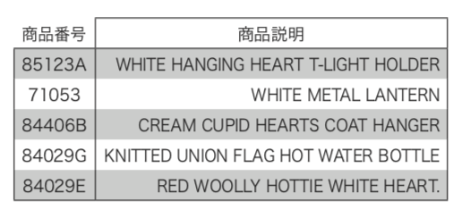
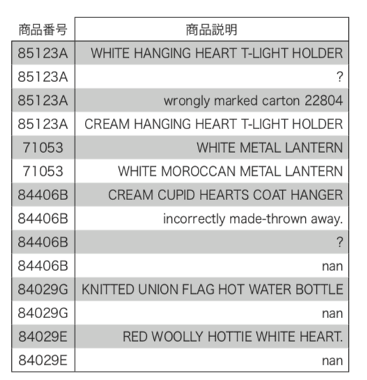
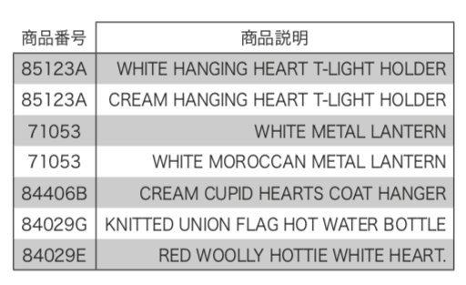
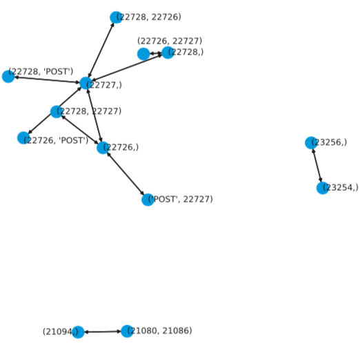

## C2 実習コーディング補足解説
以下では5.4節のコーディングの補足解説をします。
Notebookは、5.4節と共通のch05_04_item_recommend.ipynbを利用しますので、ご注意下さい。

<h3 id="C21">商品名辞書の作成</h3>

　5.4節で紹介したアソシエーション分析の結果わかるのは、キーとしての商品番号だけです。より深く商品を分析するには、商品名も知る必要があります。  
　実プロジェクトであれば、売り上げデータと別に、商品コードと商品名の対応表を入手すれば解決できる問題です。しかし、実際には簡単にそのデータが入手できないこともあります。そうした場合の練習課題として、今回使った学習データだけを使って、商品番号と商品名の対応表を作ってみることにします。  
　データの内容を確認したコード5-4-2の結果を見直すと、「商品説明」の欄に商品名が含まれているようです。そこで、この情報を手がかりに商品名辞書を作ってみます。コードC2-1-1がその実装です。

**コードC2-1-1 元データから「商品番号」と「商品説明」を抽出**

[In]

```py3
# 「商品番号」と「商品説明」のみを抽出
w3 = df2[['商品番号', '商品説明']].drop_duplicates()

# 商品番号と商品名をすべて文字列に変換
w3['商品番号'] = w3['商品番号'].astype('str')
w3['商品説明'] = w3['商品説明'].astype('str')

# 商品番号をインデックスに
w3 = w3.set_index('商品番号')
display(w3.head())
```

[Out]

<div align="left">

</div>

　まず、元データから「商品番号」「商品説明」を抜き出し、結果にdrop_duplicates関数をかけて重複を取り除いています。数値データも文字列に変換し、最後に「商品番号」をデータフレームのインデックスに設定しています。先頭5行の結果を見ると、作りたい辞書が出来上がっているように見えます。  
　本当にそうなのか、念のため確認してみます。作ったデータフレームの先頭5行から商品番号を抜き出し、その商品番号で検索をかけた実装がコードC2-1-2になります。

**コードC2-1-2 五つの商品コードで検索をした結果**

[In]

```py3
# 冒頭の5個の商品コード抽出
item_list1 = w3.index[:5]

# w3に対する検索結果
display(w3.loc[item_list1])
```

[Out]

<div align="left">

</div>

　コードの結果を見ると、実はまだきれいな形の辞書はできていなかったことがわかります。一つの商品番号に対して複数の結果が返ってきていて、nan値(Null)の場合、「?」の場合、例外的な状況の説明など、パターンも様々です。  
　データ項目「商品説明」(オリジナルの項目名は「description」)は、文字通り「説明」であって、きれいな「商品名」ではなかったのです。こうしたことは実案件ではありがちです。今ある情報だけで頑張って商品名辞書を作ってみることにします。  
　上のコードの結果を改めて見直すと、どうやら、すべての文字が大文字だと商品名になっていそうです。そこで、そのような条件で絞り込みをかけてみます。そのための実装をコードC2-1-3に示します。  

**コードC2-1-3 大文字だけのテキスト抽出**

[In]

```py3
# 大文字だけのテキストの抽出

# 作業用にコピー
w4 = w3.copy()

# すべて大文字名称の行のみ残す
w4 = w4[w4['商品説明'].map(lambda x: x.isupper())]

# 先ほど作ったitem_list1で結果確認
display(w4.loc[item_list1])
```
[Out]

<div align="left">

</div>

　Pythonではisupper関数を使って、上で説明した「すべての文字が大文字でできている」チェックができるので、それとmap関数を組み合わせて絞り込みました。  
　結果を見るとだいぶ目標に近づきましたが、まだ、同じ商品で名前が2通りあるものが見られます。一つの商品番号に複数の説明が対応した場合、一番長い文字列を選ぶ方針でさらに絞り込むことにします。  
　「商品説明」の長さを新しい列「文字数」として追加して、長さでソートしたデータを作ります。そして、同じ商品コードの中の最初の要素だけを抽出して、辞書item_dictを作ります。実装はコードC2-1-4です。

**コードC2-1-4 一番長い名称の抽出**

[In]

```py3
# 一番長い名称の抽出

# 作業用にコピー
w5 = w4.copy()

# 「文字数」列の追加
w5['文字数'] = w5['商品説明'].map(len)

# ソート
w5 = w5.sort_values(['商品番号', '文字数'], ascending=[True, False])

# 商品番号ごとに一番長い名称を抽出してitem_dictに代入
item_dict = w5.groupby('商品番号')['商品説明'].agg(lambda x: x[0])

# 先ほど作ったitem_list1で結果確認
display(item_dict.loc[item_list1])
```

[Out]

```sh
商品番号
85123A     WHITE HANGING HEART T-LIGHT HOLDER
71053            WHITE MOROCCAN METAL LANTERN
84406B         CREAM CUPID HEARTS COAT HANGER
84029G    KNITTED UNION FLAG HOT WATER BOTTLE
84029E         RED WOOLLY HOTTIE WHITE HEART.
Name: 商品説明, dtype: object
```

　データフレームのgroupby関数と、agg関数を組み合わせると、このような高度な処理も1行で実装できます。今までテストで使っていた先頭5行の検索結果も示しました。今度は正しいと思われる商品名がちょうど5件返ってきていて、これなら辞書として使えそうです。    
　本書5.4節の最後に利用した商品辞書は、こんな手順で作られていたのでした。

<h3 id="C22">C2.2 関係グラフの描画</h3>

　本コラムでは、5.4.8項の図5-4-7(関係ネットワーク図)を表示するための実装コードについて解説します。  
　「関係ネットワーク」とは、「ノード」(今回の場合は、商品または商品グループ)と、「エッジ」(ノード間の関係)によって表現されるデータです。本実習で最終結果として出したリレーション分析の結果はまさにこのようなデータになっています。この結果を視覚化しようというのが、本コラムの目的です。

#### ノードの抽出
　関係グラフを視覚化するために最初にすることは、関係するノードを一覧の形で抽出することです。そのための実装がコードC2-2-1になります。

**コード C2-2-1 ノードの抽出**

[In]

```py3
# 対象とする関係を上位50に限定
a = a_rules1.head(20)

# 親ノードの抽出
ant = a['antecedents'].values
ant = [tuple(x) for x in ant]

# 子ノードの抽出
con = a['consequents'].values
con = [tuple(x) for x in con]

# 全ノードのリストアップ
both = ant + con
both = list(set(both))

# 結果の一部確認
print(both[:10])
```

[Out]

```sh
[(21080, 21086), (22726, 'POST'), (23254,), (22726, 22727), (22728,), (22727, 'POST'), (22726,), (22728, 22727), (22728, 'POST'), (22727,)]
```

　図が複雑にならないよう、対象ルールを上位20に絞り込んで、結果のデータフレームを変数aに代入しました。
　データの抽出元となるデータフレームaには前提商品を意味する「antecedents」列と、帰結商品を意味する「consequents」列があります。この両者の各項目がノードの候補になります。ただ、これらの列の項目はfrozensetと呼ばれる特殊なデータ型なので、このまま取り扱うのは難しいです。そこで、データ型をPythonのタプルに変換しています。  
　こうやって作ったノード候補（タプル）のリストbothには重複があります。list(set(both))は、このリストを一度「集合」に変換し、最後にリストに戻しています。こうすることで、ユニークなノードのリストができます。


#### 関係グラフの構築

　候補ノードのリストアップができたら、次のステップは関係グラフの構築です。グラフはPythonの場合、networkxというライブラリを用いて構築します。その実装がコードC2-2-2になります。  

**コードC2-2-2 関係グラフの構築**

[In]

```py3
# networkx のインポート
import networkx as nx

# 関係グラフの初期化
G = nx.DiGraph()

# ノードの追加
for n in both:
  G.add_node(n)

# エッジの追加
for i in range(len(a)):
    item = a.loc[i]
    ant = tuple(item['antecedents'])
    con = tuple(item['consequents'])
    G.add_edge(ant, con)
```

　まず関係グラフGをnx.DiGraph()で初期化しています。
　次に、前のステップでノード一覧として用意した変数bothを用いて、各要素(ノード)をadd_node関数で登録します。  
　最後に「エッジ」と呼ばれるノード間の関係をadd_edge関数で登録していきます。関係を示すデータフレームaの各行で、「antecedents」と「consequents」の項目を取り出し、その結果をadd_edge関数の引数とします。

#### 関係グラフの描画

　これで関係グラフは完成しました。後はこの結果を視覚化するだけです。そのための実装が、コードC2-2-3になります。  

**コードC2-2-3 関係グラフの視覚化**

[In]

```py3
# グラフ描画
pos = nx.spring_layout(G, k=0.6, seed=random_seed)

plt.figure(figsize=(8, 8))
nx.draw_networkx_nodes(G, pos)
nx.draw_networkx_edges(G, pos)
nx.draw_networkx_labels(G, pos,
    horizontalalignment='left', 
    verticalalignment='center')
plt.axis('off')
plt.tight_layout()
plt.show()
```
[Out]

<div align="left">

</div>

　このコードでポイントになるのが、一番上のspring_layout関数です。この関数を呼び出すことで各ノードは初めて物理的な位置が計算され、グラフを描画できるようになります。後は、draw_networkx_codes関数、draw_networkx_edges関数、draw_networkx_labels関数を順に呼び出すだけで、上のような関係グラフが描画されます。 
　
