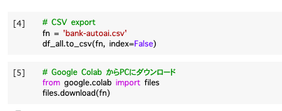

# C3 AutoAI補足

[C3.1 実習用CSV生成とその後の手順概要](#C31)  
[C3.2 自動生成モデルのチューニング方法](#C32)

<h3 id="C31">C3.1 実習用CSV生成とその後の手順概要</h3>

#### AutoAI用CSVデータの作成
　Notebookファイル``c31_bank_autoai_data.ipynb``を利用して、本書の5.1節で利用したのと同じデータをAutoAI用に生成します。  
　Notebookファイルの処理の内容は以下の通りです。


* UCIデータセットの読み込み
* 項目名の日本語化
* 訓練用60%、検証用40%の比率でデータ分割
* 訓練用・検証用2つのデータフレームのcsv化
* csvファイルのダウンロード

　当サイトから一括ダウンロードしたNotebookファイルに含まれている、``c31_bank_autoai_data.ipynb``をGoogle Colabにアップロードします。

<div align="left">

</div>

 セルを一番上から最後まで順に実行します。
 
 <div align="left">

</div>

 最後のセルまで実行すると、``bank-train-autoai.csv``と``bank-test-autoai.csv``いうファイルが生成されます。このうち、``bank-train-autoai.csv``ファイルを入力ファイルとして、AutoAIでモデルを生成します。
 
#### AutoAI利用のための準備
 ガイドに従って、AutoAI利用のための準備を行います。
 
 [無料でなんでも試せる! Watson Studioセットアップガイド](https://qiita.com/makaishi2/items/b666f847a98c2e42dfbb)

 ガイドの大まかな内容は以下のとおりです、
 
* IBM Cloudにユーザー登録(クレジットカード不要)
* Watson Studioのインスタンス作成
* Watson Studioのプロジェクト作成
* Watson Machine Learningのインスタンス作成とプロジェクトへの紐付け
 
 
#### AutoAIを使ってモデルを生成
　ここまでの準備ができれば、あとは本当に簡単にモデルを生成できます。手順については、下記を参照して下さい。

[AutoAIでお手軽機械学習(その2) モデル構築編](https://qiita.com/makaishi2/items/d6cd449f7a9f7186a833)


<h3 id="C32">C3.2 自動生成モデルのチューニング方法</h3>

#### Jupyter Notebookの生成から、Google Colabへのロード・実行
　この手順については、qiitaに記事を記載しました。
こちらを参照して下さい。

[AutoAIでお手軽機械学習(その4) Jupyter Notebook編](https://qiita.com/makaishi2/items/0c59ae675362c9f85640)

#### 新しいセルの追加

　Notebookの最後に新しいセルを4つ追加し、それぞれに下記のコードを貼り付けて下さい。

```py3
# 確率値の取得
w = pipeline.predict_proba(X_holdout)

# yes (陽性)の確率値
w1 = w[:,1]

# 結果の一部確認
print(w1[:10])
```

```py3
# 閾値を変更した場合の予測関数の定義
# (書籍と同じもの)
def pred(algorism, x, thres):
    # 確率値の取得(行列)
    y_proba = algorism.predict_proba(x)
    
    # 予測結果1の確率値
    y_proba1 =  y_proba[:,1]
    
    # 予測結果1の確率値 > 閾値
    y_pred = (y_proba1 > thres).astype(int)
    return y_pred
```

```py3
# 正解値を yes / no から 1/0 に変換
y_bin = (y_holdout == 'yes').astype(int)
print(y_holdout[:10])
print(y_bin[:10])
```

```py3
# 閾値を0.05刻みに変化させて、適合率, 再現率, F値を計算する
from sklearn.metrics import precision_recall_fscore_support
thres_list = np.arange(0, 1, 0.05)

for thres in thres_list:
    y_pred = pred(pipeline, X_holdout, thres)
    pred_sum =  y_pred.sum()
    precision, recall, fscore, _ = precision_recall_fscore_support(
        y_bin, y_pred, average='binary')
    print(f'閾値: {thres:.2f} 陽性予測数: {pred_sum}\
 適合率: {precision:.4f} 再現率: {recall:.4f}  F値: {fscore:.4f})')
```

#### 追加セルの実行結果と解説

　4つの追加セルで、どのような結果が出るかと、その解説を簡単に行います。

##### step 1　確率値の取得

[In]

```py3
# 確率値の取得
w = pipeline.predict_proba(X_holdout)

# yes (陽性)の確率値
w1 = w[:,1]

# 結果の一部確認
print(w1[:10])
```

[Out]

```sh
[0.01551239 0.39566529 0.89198088 0.87449828 0.89343122 0.89688935
 0.01805331 0.51872598 0.91175586 0.50754021]
```

　AutoAIでは、できたモデルの変数名は``pipeline``です。また、検証用の入力データの変数名は``X_holdout``になります。それで、モデルから検証データの確率値を取するコードは``pipeline.predict_proba(X_holdout)``となります。

##### step2　閾値付きの予測関数定義

[In]

```py3
# 閾値を変更した場合の予測関数の定義
# (書籍と同じもの)
def pred(algorism, x, thres):
    # 確率値の取得(行列)
    y_proba = algorism.predict_proba(x)
    
    # 予測結果1の確率値
    y_proba1 =  y_proba[:,1]
    
    # 予測結果1の確率値 > 閾値
    y_pred = (y_proba1 > thres).astype(int)
    return y_pred
```

　確率値を取得する関数``pred``の定義です。実装は書籍とまったく同じなので、解説は省略します。

##### step3　正解値の変換

[In]

```py3
# 正解値を yes / no から 1/0 に変換
y_bin = (y_holdout == 'yes').astype(int)
print(y_holdout[:10])
print(y_bin[:10])
```

[Out]

```sh
['no' 'no' 'yes' 'no' 'no' 'yes' 'no' 'no' 'yes' 'no']
[0 0 1 0 0 1 0 0 1 0]
```

　AutoAIで生成したモデルは、出力値が 'yes' / 'no' という文字列になっています。pred関数では、予測値は1/0であることが必要なので、正解値を1/0の形に変換します。変換後の正解値は``y_bin``に保存しています。

##### step4 閾値を変えて、適合率、再現率の計算

[In]


```py3
# 閾値を0.05刻みに変化させて、適合率, 再現率, F値を計算する
from sklearn.metrics import precision_recall_fscore_support
thres_list = np.arange(0, 1, 0.05)

for thres in thres_list:
    y_pred = pred(pipeline, X_holdout, thres)
    pred_sum =  y_pred.sum()
    precision, recall, fscore, _ = precision_recall_fscore_support(
        y_bin, y_pred, average='binary')
    print(f'閾値: {thres:.2f} 陽性予測数: {pred_sum}\
 適合率: {precision:.4f} 再現率: {recall:.4f}  F値: {fscore:.4f})')
```

[Out]

```sh
閾値: 0.00 陽性予測数: 2713 適合率: 0.1168 再現率: 1.0000  F値: 0.2092)
閾値: 0.05 陽性予測数: 1775 適合率: 0.1786 再現率: 1.0000  F値: 0.3031)
閾値: 0.10 陽性予測数: 1403 適合率: 0.2252 再現率: 0.9968  F値: 0.3674)
閾値: 0.15 陽性予測数: 1203 適合率: 0.2602 再現率: 0.9874  F値: 0.4118)
閾値: 0.20 陽性予測数: 1062 適合率: 0.2938 再現率: 0.9842  F値: 0.4525)
閾値: 0.25 陽性予測数: 965 適合率: 0.3192 再現率: 0.9716  F値: 0.4805)
閾値: 0.30 陽性予測数: 874 適合率: 0.3501 再現率: 0.9653  F値: 0.5139)
閾値: 0.35 陽性予測数: 802 適合率: 0.3778 再現率: 0.9558  F値: 0.5416)
閾値: 0.40 陽性予測数: 747 適合率: 0.3989 再現率: 0.9401  F値: 0.5602)
閾値: 0.45 陽性予測数: 683 適合率: 0.4275 再現率: 0.9211  F値: 0.5840)
閾値: 0.50 陽性予測数: 639 適合率: 0.4476 再現率: 0.9022  F値: 0.5983)
閾値: 0.55 陽性予測数: 590 適合率: 0.4729 再現率: 0.8801  F値: 0.6152)
閾値: 0.60 陽性予測数: 531 適合率: 0.5066 再現率: 0.8486  F値: 0.6344)
閾値: 0.65 陽性予測数: 474 適合率: 0.5295 再現率: 0.7918  F値: 0.6346)
閾値: 0.70 陽性予測数: 427 適合率: 0.5504 再現率: 0.7413  F値: 0.6317)
閾値: 0.75 陽性予測数: 368 適合率: 0.5870 再現率: 0.6814  F値: 0.6307)
閾値: 0.80 陽性予測数: 313 適合率: 0.6166 再現率: 0.6088  F値: 0.6127)
閾値: 0.85 陽性予測数: 223 適合率: 0.6413 再現率: 0.4511  F値: 0.5296)
閾値: 0.90 陽性予測数: 75 適合率: 0.7733 再現率: 0.1830  F値: 0.2959)
閾値: 0.95 陽性予測数: 11 適合率: 0.9091 再現率: 0.0315  F値: 0.0610)
```

本書4.4節、5.1節で解説した手法をAutoAIで自動生成したモデルに適用した結果です。  
本書の実習の中で作ったモデルの場合、一番性能がよかったパターンは閾値=0.30の時で、適合率0.5649、再現率0.6437、F値0.6017でした。  
それに対してAutoAIのモデルでは、似たケースとして閾値0.75で適合率0.5870、再現率0.6814、F値0,6307というケースがあります。  
両者を比較すると、AutoAIの方が性能がいいということがわかります。