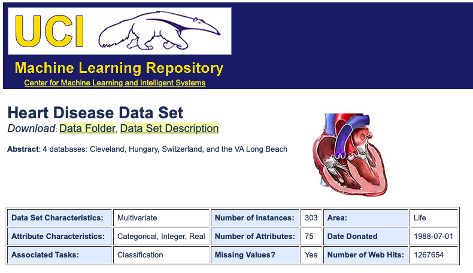
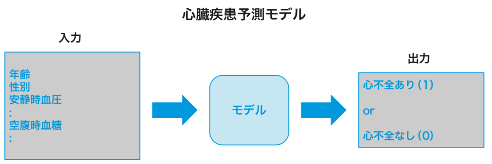
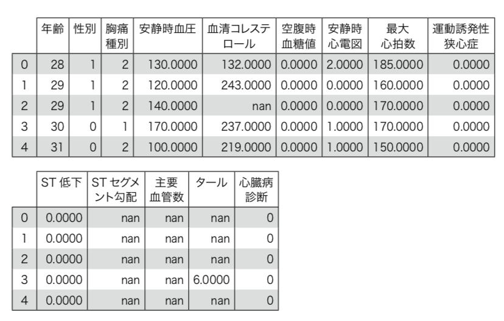
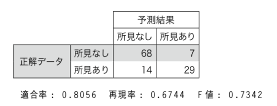
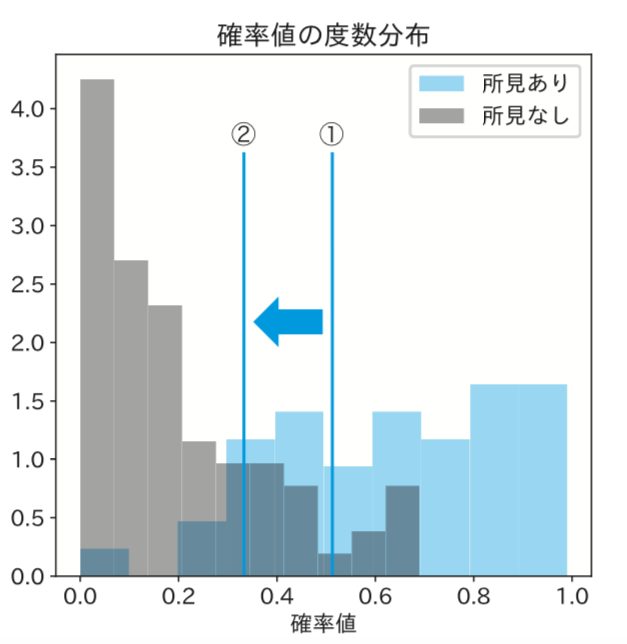
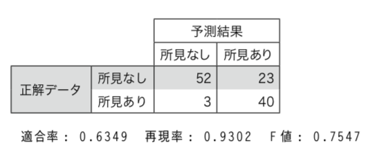

## 追加事例1 欠陥・疾患判定の自動化 (2値分類と再現率)
　当追加事例で取りあげるテーマは欠陥・疾患判定です。処理パターンとしては本編5.1節と同じ2値分類ですが、「全体の中では数が少ない例外の方を漏れなく見つけたい」というユースケースになります。  

[A1.1 処理パターンと想定される業務利用シーン](#A11)  
[A1.2 例題のデータ説明とユースケース](#A12)  
[A1.3 モデル実装概要](#A13)  
[A1.4 データ読み込みからデータ確認まで](#A14)  
[A1.5 データ前処理とデータ分割](#A15)  
[A1.6 アルゴリズム選定](#A16)  
[A1.7 学習・予測・評価](#A17)  
[A1.8 チューニング](#A18)  
[A1.9 実業務適用時の考慮点](#A19)

<h3 id="A11">A1.1 処理パターンと想定される業務利用シーン</h3>

　当追加事例が、本編5.1節の「営業成約予測」と大きく違うのは業務観点での「評価方法」です。  
　営業成約の予測では、「営業活動の効率化」が業務的な目標であり、その効率性は「適合率」で評価するのが適切だと説明しました。予測した見込み顧客の中で実際に成功する確率（適合率）を上げるのが目的であり、成約できるはずの顧客を取りこぼすことは、相対的には大きな問題ではありませんでした。  
　本節で取り上げる「心臓疾患の判定」の場合、重視されるのは、「本当に疾患を持った人をいかに取りこぼしなく洗い出せるか」という観点です。この観点に対応した評価手法が「再現率」です。本当に疾患を持った人を、疾患ありと判定できた割合（再現率）を上げるのが目的であり、疾患ありと予測した人の中での実際の疾患率（適合率）が低くても、再現率が低いことに比べれば問題ではありません。    
　これと同じような業務観点の処理パターンには、工場での欠陥品検査のようなものがあります。この場合、ほとんどの製品が「異常なし」であるのに対して、ごく少数の「異常の可能性のある製品」をいかに漏れなく洗い出せるかが重要です。もし、欠陥を持った製品がそのまま出荷されてしまうと、損害賠償など、大きなビジネス上の損失リスクを発生させることになるからです。  
　本節は、たまたま利用しやすい公開データセットが病気疾患判定だったため、このテーマで実習を進めます。しかし、他にも様々な業務に適用できることを頭において読み進めてください。

<h3 id="A12">A1.2 例題のデータ説明とユースケース</h3>

 本節で取りあげるデータセットも、前節同様UCIから提供されているもので、「Heart Disease Data Set」と呼ばれています。
 
<div align="left">

</div>


図A1-1 Heart Disease Data Setの画面  
[https://archive.ics.uci.edu/ml/datasets/Heart+Disease](https://archive.ics.uci.edu/ml/datasets/Heart+Disease) 

　第２次AIブームの時に作られたMYCIN をはじめとして、昔から医療とAIは深い関係にあります。今でも各国の医療機関が機械学習モデルの開発用に、様々な検査・診察データ(入力データ)と医者の診断結果(正解データ)をセットにしたデータを公開しています。そうしたデータを使うと、比較的簡単に機械学習モデルが作れます。本節で例題として取りあげるのも、そのような公開データセットの一つです。  
　データ項目は以下の通りです。入力変数はいずれも、心臓病患者の診察・検査で医者が利用する項目です。各項目の詳しい解説はNotebook中に記載しておいたので、関心がある読者は参照してください。  
　目的変数の「心不全あり」「心不全なし」は、医者が実際に診察した結果になります。

**入力変数**

年齢(age)、性別(sex)、胸痛種別(cp)、安静時血圧(trestbps) 、血清コレステロール(chol) 、空腹時血糖(fbs)、安静時心電図(restecg)、最大心拍数(thalch)、運動誘発性狭心症(exang)、ST低下(oldpeak)、STセグメント勾配(slope)、主要血管数(ca)、タール(thal)

**目的変数**  

心臓病診断(num)　心不全あり 心不全なし

　このデータセットは、複数の医療機関ごとのデータが別ファイルとして存在しています。また、多くの項目があるフルデータセットと、項目数を14に減らした簡易版があります。今回の実習ではこのうち、医療機関はハンガリーのものであるhungarian、データセットとしては14項目の簡易版を利用しました。

**利用シナリオ**  
　モデルの構造としては、上で説明した入力変数を使って、医者の診察結果に該当する「心臓病診断」を機械学習モデルが出力する形になります。ただし、医療分野で本当にAIを利用するには、大きな課題があります。  
　「医者でなく機械が医療診断をしてよいのか」や「誤診で事故が起きたときにだれが責任を取るのか」といった倫理上の課題です。そのため、今、考えられている有力な使い方は、「医者に助言をする」というケースです。このような「医療とAIの関わり」のことも頭においてください。  
　商品の欠陥検出の場合も、同じように実際の利用シーンでは考慮が必要です。それは、機械学習モデルではそもそも100%の精度は期待できず、また後ほど説明するように、「再現率」を上げようと（閾値を）調整すると、欠陥と予測した商品に正常なものも数多く混入してしまうためです。そのため、機械学習モデルによる自動判別と、人による判断を組み合わることがよく行われます。機械学習モデルで怪しい商品を抽出し、数が少なくなった状態で人の目で細かく振り分けます。これで省力化という観点で効果が上がれば、機械学習モデルを適用する価値があります。  
　いずれにしても本節のような再現率重視の処理パターンでは多くの場合、業務に適用する際に一工夫が必要になることを覚えておいてください。  　

<h3 id="A13">A1.3 モデル実装概要</h3>

　今回のモデルで予測したいことは、患者が心臓病疾患を持っているかどうかです。yesかnoかを予測するモデルでかつ、正解データがわかった状態で学習するので、処理パターンは「教師あり2値分類」になります。2章で一度示していますが、ブラックボックスとしてのモデルの振る舞いを図A1-2に改めて示しました。  
　
<div align="left">

</div>
図A1-2 心臓疾患予測モデルの動作イメージ

<h3 id="A14">A1.4 データ読み込みからデータ確認まで</h3>


　ここから実習の内容に入ります。最初にすることは、5.1節の時と同様で、学習データの読み込みと読み込んだデータの確認になります。

#### データ読み込み  
　最初にネット上に公開されている公開データセットを読み込みます。実装はコードA1-1です。

**コード A1-1 心疾患公開データ読み込み**

[In]  

```py3
# 心疾患公開データ読み込み

columns = [
    '年齢', '性別', '胸痛種別', '安静時血圧',  '血清コレステロール',
    '空腹時血糖値', '安静時心電図',  '最大心拍数',  '運動誘発性狭心症',
    'ST低下', 'STセグメント勾配', '主要血管数', 'タール', '心臓病診断'
]

# 公開データセットのURL
url_hu = 'https://archive.ics.uci.edu/ml/machine-learning-databases/\
heart-disease/processed.hungarian.data'

# データフレームへの取り込み
# 欠損値は'?'で表現されているので、読み込み時にPythonのNaNに変換する
df_hu = pd.read_csv(url_hu, header=None, names=columns, na_values='?')
```


　読み込むファイルの拡張子が'.data'となっていますが、中身はCSVなので、``read_csv``関数がそのまま使えます。  
　このデータでは欠損値が'?'で表現されています。  
　Pythonで処理する場合はNaN値として取り込んだ方が後の処理が楽なので``na_values='?'``のオプションを付け、'?'の文字の場所をNaNに置き換えています。``header=None``のオプションは、普通のCSVでは先頭行が項目名リストになっていますが、それがないことを示すためのフラグです。

#### データ確認  
　次のステップはデータの確認です。まずは、いつものようにdisplay関数でデータ全体を確認してみます。実装と結果はコードA1-2です。

**コードA1-2 データ全体の確認**

[In]  

```py3
# データ全体の確認
display(df_hu.head())
```


[Out]  

<div align="left">

</div>

　すべて数値データで、その点はやりやすそうですが、いくつかの項目で欠損値(Colabでは「nan」と表示される)が含まれているので、その対応が必要です。この点は後ほど詳しく調べます。

　次にデータ全体の件数、項目数と、正解データの値の分布を確認します。実装はコードA1-3です。

**コードA1-3 学習データの状況確認**

[In]  

```py3
# 学習データ件数と項目数確認
print(df_hu.shape)
print()

# 「心臓病診断」の値の分布確認
print(df_hu['心臓病診断'].value_counts())
print()

# 所見あり比率
rate = df_hu['心臓病診断'].value_counts()[1]/len(df_hu)
print(f'有症率: {rate:.4f}')
```


[Out]  

```sh
(294, 14)

0    188
1    106
Name: 心臓病診断, dtype: int64

有症率: 0.3605
```

　データ件数は294件とやや少なめです 。正解データは、疾患ありの比率が36%と、ややアンバランスですが、それほど極端な状況ではないようです。

　すべての項目が数値だったので、データフレームのhist関数で、各項目の度数分布をまとめて表示させます。実装はコードA1-4になります。

**コード A1-4 各項目の度数分布表示**  
[In]  

```py3
# 度数分布表示

# グラフのサイズ調整のためのおまじない
from pylab import rcParams
rcParams['figure.figsize'] = (12, 12)

# データフレームの数値項目でヒストグラム表示
df_hu.hist()
plt.show()
```

[Out]  

<div align="left">

</div>

　hist関数の結果を見ると、性別（0か1）のようにラベル値になっている項目と、安静時血圧のように様々な数値を取る項目がひと目で分かります。性別は二つの棒だけのグラフになっているのに対し、安静時血圧は一定の範囲で値が連続的に変化しています。この結果は、次のステップの欠損値の対応処理で活用することになります。
　データ確認の最後のステップとして項目ごとの欠損値を確認しましょう。実装はコードA1-5です。

**コード A1-5 欠損値の確認**

[In]  

```py3
# 欠損値確認
print(df_hu.isnull().sum())
```


[Out]  

```sh
年齢             0
性別             0
胸痛種別           0
安静時血圧          1
血清コレステロール     23
空腹時血糖値         8
安静時心電図         1
最大心拍数          1
運動誘発性狭心症       1
ST低下           0
STセグメント勾配    190
主要血管数        291
タール          266
心臓病診断          0
dtype: int64
```

　かなり多くの項目に欠損値があるようで、その対応が必要だとわかります。

<h3 id="A15">A1.5 データ前処理とデータ分割</h3>

　続いて、データ前処理と、データ分割をします。データ前処理では、上で確認した欠損値に対応します。

#### データ前処理
　欠損値に対しては、連続的に変化する値を取る項目は平均値、ラベル値を取る項目は最頻値で埋める方針とします。コードA1-4の結果を参考に各項目の対応を決めると、次のようになります。

安静時血圧: 平均値  
血清コレステロール: 平均値  
空腹時血糖値: 0 (最頻値)  
安静時心電図: 0 (最頻値)  
最大心拍数: 平均値  
運動誘発性狭心症: 0 (最頻値)  
STセグメント勾配: 2 (最頻値)  

　また、そもそも欠損値でないデータの数が非常に少ない、「主要血管数」と「タール」はあまり予測の役に立たなそうなので、項目ごと削除することにします。以上の方針を実装化したのが、次のコードA1-6とコードA1-7になります。  
　最初にコードA1-6で、平均値で置き換える「安静時血圧」「血清コレステロール」「最大心拍数」の平均値を求めます。

**コードA1-6 平均値を計算**

[In]  

```py3
# 平均値の計算
ave1 = df_hu['安静時血圧'].mean()
ave2 = df_hu['血清コレステロール'].mean()
ave3 = df_hu['最大心拍数'].mean()

# 結果確認
print(f'安静時血圧: {ave1:.1f}  血清コレステロール: {ave2:.1f}   最大心拍数:{ave3:.1f}')
```

[Out]  

```sh
安静時血圧: 132.6  血清コレステロール: 250.8   最大心拍数:139.1
```

　次にコードA1-7で欠損値の置き換えと、列削除をします。

**コードA1-7 欠損値の対応**


[In]  

```py3
# 欠損値の置換
df2 = df_hu.fillna(
    {'安静時血圧': ave1,
    '血清コレステロール': ave2,
    '空腹時血糖値': 0,
    '安静時心電図': 0,
    '最大心拍数': ave3,
    '運動誘発性狭心症': 0,
    'STセグメント勾配': 2}
)

# 列の削除
df3 = df2.drop(['主要血管数', 'タール'], axis=1)
```

　最後に、欠損値がなくなっているか、データが意図した結果になっているか確認します。実装と結果はコードA1-8です。

**コードA1-8 前処理結果の確認**

[In]  

```py3
# 結果確認
print(df3.isnull().sum())
display(df3.head())
```


[Out]  

```sh
年齢           0
性別           0
胸痛種別         0
安静時血圧        0
血清コレステロール    0
空腹時血糖値       0
安静時心電図       0
最大心拍数        0
運動誘発性狭心症     0
ST低下         0
STセグメント勾配    0
心臓病診断        0
dtype: int64
```
[dataframe t.b.d.]

　意図したように、すべての項目で欠損値がなくなりました。そこで、次のデータ分割のステップに進みます。

#### データ分割
　コードA1-9が次のデータ分割の実装です。

**コードA1-9 データ分割の実装**

[In]  

```py3
# 入力データと正解データの分離
x = df3.drop('心臓病診断', axis=1)
y = df3['心臓病診断'].values

# 訓練データと検証データの分離
test_size=0.40

from sklearn.model_selection import train_test_split
x_train, x_test, y_train, y_test = train_test_split(
  x, y, test_size=test_size, random_state=random_seed,
  stratify=y)
```

　データ分割については、いつもと同じなので、特に解説はしません。

<h3 id="A16">A1.6 アルゴリズムの選定</h3>
　
　次のステップはアルゴリズムの選定です。候補のアルゴリズムのリストを作り、リストの各要素に対して、交差検定で調べるコードは5.1節とまったく同じなので、紙面への掲載は省略します。交差検定の実行結果のみを、図A1-3に掲載します。  

**図A1-3 交差検定の実行結果**

[Out]  

```sh
平均スコア: 0.8569  個別スコア: [0.8534 0.9323 0.7851]  LogisticRegression
平均スコア: 0.6994  個別スコア: [0.6936 0.8152 0.5894]  DecisionTreeClassifier
平均スコア: 0.8856  個別スコア: [0.8747 0.9449 0.8372]  RandomForestClassifier
平均スコア: 0.8402  個別スコア: [0.8221 0.9148 0.7838]  XGBClassifier
```

　5.1節と異なり、今回はランダムフォレストの性能が最も良いという結果になりました。そこで、今回はランダムフォレストを採用することにします。

<h3 id="A17">A1.7 学習・予測・評価</h3>

　次のステップは学習・予測・評価ですが、この箇所も実装コードは5.1節のものとほぼ同じです。そこで、コード掲載と解説は省略し、結果だけ図A1-4に掲載します。
　
<div align="left">

</div>

　所見ありという予測結果の正解率である適合率が80.56%であり、営業見込み客システムなら十分過ぎる結果です。しかし、所見ありの正解データの中で正しく予測した再現率が66.44%で、本来「所見あり」なのにチェックから漏れてしまっているケースがかなりあります。疾患の判定という業務的観点から、この点を改善する必要がありそうです。

<h3 id="A18">A1.8 チューニング</h3>

　5.1節同様、モデルの閾値を調整することで、業務的により望ましい結果を得られるよう、チューニングすることにします。
　まず、モデル出力の確率値を横軸に、正解データ別の度数分布グラフを作ります。結果は、図A1-5に示しました。
　
<div align="left">

</div>

**図A1-5 確率値の度数分布グラフ**

　今回も5.1節のときと同じで、閾値をデフォルトの0.5の状態(①)からより小さな値(②)に変化させることで、現在はチェックから漏れているかなりの数の「所見あり」のケースを拾えそうです。これからその最適な値を調べます。実装はコードA1-10です。  
  
**コードA1-10 閾値を変化させて適合率・再現率・F値を計算**

[In]  

```py3
# 閾値を0.05刻みに変化させて、適合率, 再現率, F値を計算する
thres_list = np.arange(0.5, 0, -0.05)

for thres in thres_list:
    y_pred2 = pred(algorism, x_test, thres)
    pred_sum =  y_pred2.sum()
    precision, recall, fscore, _ = precision_recall_fscore_support(
        y_test, y_pred2, average='binary')
    print(f'閾値: {thres:.2f} 合計: {pred_sum}  適合率: {precision:.4f}\
  再現率: {recall:.4f}  F値: {fscore:.4f})')
```


[Out]  

```sh
閾値: 0.50 合計: 36  適合率: 0.8056  再現率: 0.6744  F値: 0.7342)
閾値: 0.45 合計: 38  適合率: 0.7895  再現率: 0.6977  F値: 0.7407)
閾値: 0.40 合計: 46  適合率: 0.7391  再現率: 0.7907  F値: 0.7640)
閾値: 0.35 合計: 52  適合率: 0.7115  再現率: 0.8605  F値: 0.7789)
閾値: 0.30 合計: 58  適合率: 0.6724  再現率: 0.9070  F値: 0.7723)
閾値: 0.25 合計: 63  適合率: 0.6349  再現率: 0.9302  F値: 0.7547)
閾値: 0.20 合計: 68  適合率: 0.6029  再現率: 0.9535  F値: 0.7387)
閾値: 0.15 合計: 77  適合率: 0.5455  再現率: 0.9767  F値: 0.7000)
閾値: 0.10 合計: 84  適合率: 0.5000  再現率: 0.9767  F値: 0.6614)
閾値: 0.05 合計: 98  適合率: 0.4286  再現率: 0.9767  F値: 0.5957)
```

　どの閾値の値を最適か判断するのは難しいのですが、上の結果から閾値=0.25であれば、それほど適合率を下げずに、かなり高い再現率が望めそうです。そこで、この値を今回の閾値として採用することとします。  
　この値を閾値とした場合の、混同行列と、適合率、再現率、F値を改めて求めましょう。実装と結果はコードA1-11です。  


**コードA1-11 閾値=0.25の場合の評価結果**

[In]  

```py3
# 再現率重視で閾値を0.25にする
y_final = pred(algorism, x_test, 0.25)

# 混同行列を出力
from sklearn.metrics import confusion_matrix
df_matrix4 = make_cm(
    confusion_matrix(y_test, y_final),
    ['所見なし', '所見あり'])
display(df_matrix4)

# precision, recall, fscare
precision, recall, fscore, _ = precision_recall_fscore_support(
    y_test, y_final, average='binary')
print(f'適合率: {precision:.4f}  再現率: {recall:.4f}  F値: {fscore:.4f}')
```

[Out]  

<div align="left">

</div>

<h3 id="A19">A1.9 実業務適用時の考慮点</h3>

　最後のチューニングのところで説明した再現率の話は、実業務をAI化するにあたって最も難しい点です。それは、再現率を重視する欠陥・疾患判定系ユースケースの場合、要件として100%の再現率を求められることが多いからです。典型的なのが検品のタスクで、そもそも欠陥率が非常に少ないところに持ってきて、1件でも欠陥品が出荷されると大問題なので、業務要件としては100%の再現率が必要なことになってしまいます。  
　しかし、例えば今回の実習で100%の再現率を望むとすると、図A1-5を見ればわかる通り閾値＝0.00、つまり何も判断しないモデルにする必要があります。ここに、100%の精度は望めない機械学習モデルの性質と、「検出ミスを許されない」欠陥・疾患判定系のタスクの相性の悪さが出てしまうのです。   
　本当に実業務に適用するAIプロジェクトを企画する場合、こうした問題まで十分考慮した上で始めてください。
