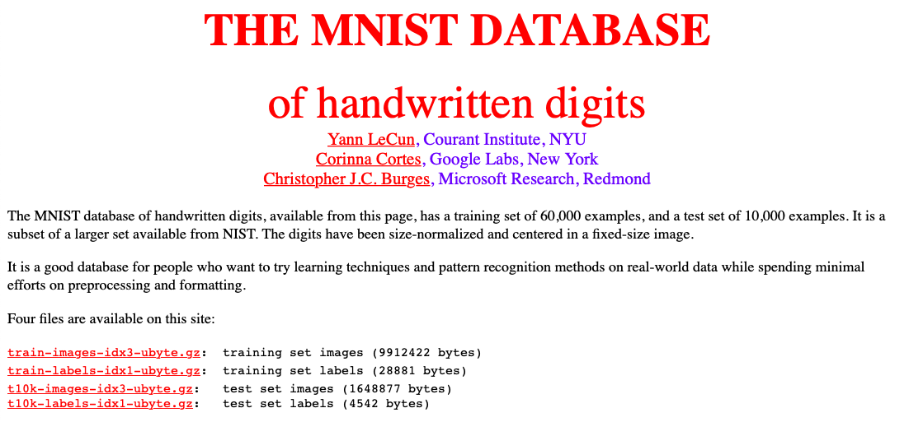
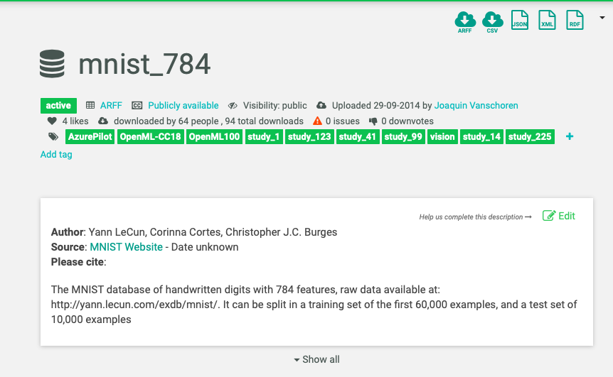
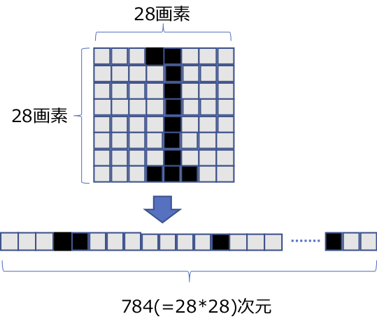
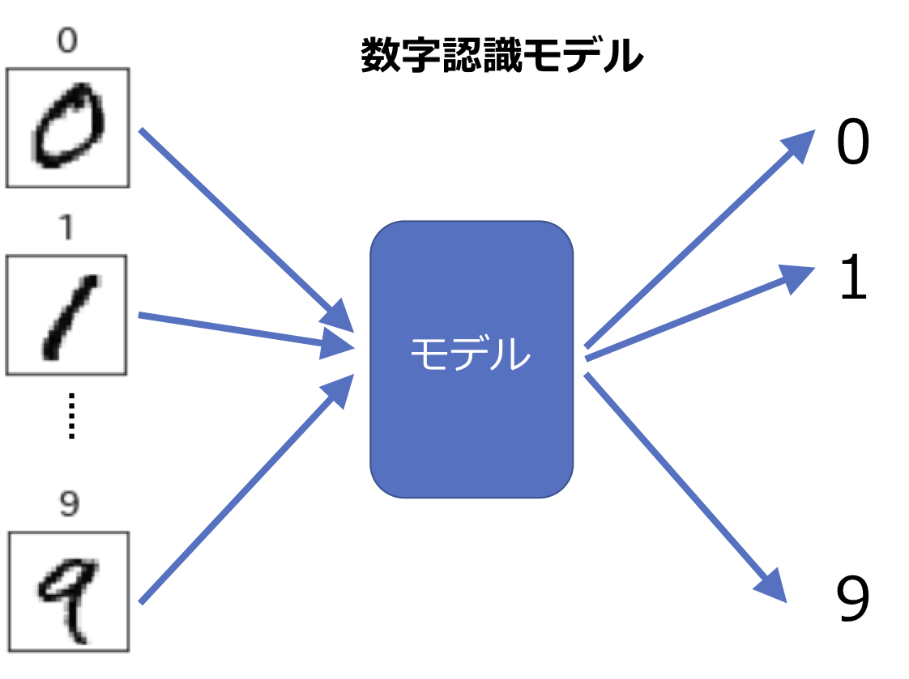
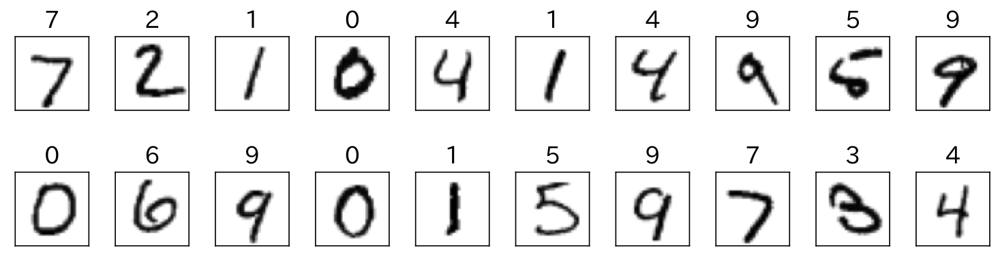
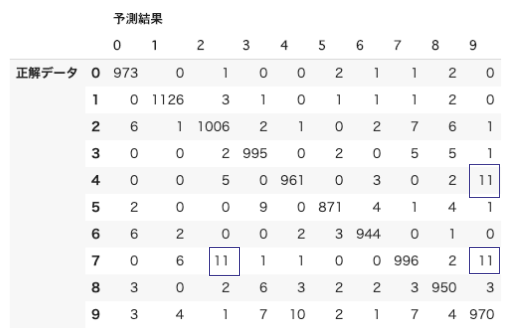
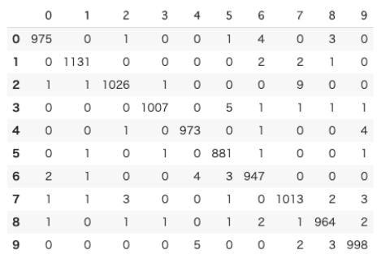
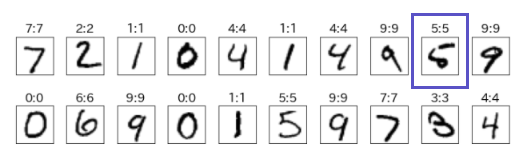

## 追加事例2 画像による判別 (イメージデータの多値分類)
　本事例の例題は、本書の中では取り扱っていなかった「多値分類」の処理パターンです。

[目次]  
[A2.1 処理パターンと想定される業務利用シーン](#A21)  
[A2.2 例題のデータ説明とユースケース](#A22)  
[A2.3 モデル実装概要](#A23)  
[A2.4 データ読み込みからデータ確認まで](#A24)  
[A2.5 データ前処理とデータ分割](#A25)  
[A2.6 アルゴリズムの選定](#A26)  
[A2.7 学習・予測](#A27)  
[A2.8 評価](#A28)   
[A2.9 チューニング](#A29)  
[コラム イメージデータ表示コードの解説](#AC21)  
[コラム　テキストデータを機械学習モデルの入力とする方法](#AC22)

<h3 id="A21">A2.1 処理パターンと想定される業務利用シーン</h3>

　「多値分類」とは、読んでわかる通り分類先のグループが二つでなく、三つ以上の処理パターンです。構造化データ を使った多値分類は、サンプルのデータセットを使った例題なら、ワインの原料のブドウ品種を分類するモデルなどがありますが、実業務で応用可能なものは意外に少ないです。  
　世の中でよく利用される「多値分類」のモデルは実は、「テキスト」や「画像」あるいは「音声」といった、非構造化データ(注1)を入力としたものが多いのです。そして従来型の機械学習モデルが比較的苦手としてきた、このような非構造化データを対象としたモデルが、ディープラーニングの発達で大きな成果を収めるようになってきたことは、本編の2.6節「ディープラーニングと構造化データ・非構造化データ」で簡単に解説しました。  
　本節ではこのような技術的背景も鑑みて、「手書き数字データセット」を学習データとした多値分類モデルを取りあげます。  

　画像データを入力とした分類モデルの事例として、読者にもなじみのあるのが、Facebookの写真による自動タグ付け機能でしょう。この他にも、CT画像を入力とした疾患診断では、専門医を上回る精度を実現している例もあるといわれています。まだ始まったばかりの技術領域で、具体的なユースケースについては、これから徐々に広がっていくものと考えられます。本節では、画像認識のモデルはどのような方法で作られているのか、実習を通じて基本の技術を理解することで、新しいビジネスモデルを考案するヒントになればよいと考えています。  

<h3 id="A22">A2.2 例題のデータ説明とユースケース</h3>

　本節の実習で利用するのは、ディープラーニングの例題でよく用いられる「**MNIST手書き数字データセット**」です。  
　この公開データセットを取りあげるのは、学習の題材として有名なこともありますが、従来型の機械学習モデルで扱えるぎりぎりの複雑さのデータということが、より大きな理由です。ディープラーニングの機械学習モデルは学習済みのものがネット上に公開されていて、例えば「VGG19」と呼ばれるモデルでは100万枚のデータを使った学習で1000個のクラス（ラベル値）に分類が可能です。学習データの数が膨大なのに驚きますが、分類先クラスが1000個ということにも驚きます。このような巨大なデータセットはもはやディープラーニングでしか対応できないのですが、手書き数字のデータセットは、本編で説明したアルゴリズムのうち、「サポートベクターマシン」で十分な精度が得られるのです。  
　モデル内部の複雑さは異なりますが、モデル自体をブラックボックスと考え「入力データ」「出力データ」の関係で「処理パターン」を理解する観点では、VGG19もこれから実装する数字認識モデルもまったく同じです。本節で実習する数字認識モデルの進化形がディープラーニングを利用した画像認識モデルであることを頭において、本節の処理パターンを理解し、実習を進めるようにしてください。  

　「MNIST手書き数字データセット」のオリジナルデータの公開サイトを図A2-1に示しました。

<div align="left">

</div>
  
**図A2-1 MNIST手書き数字データセットの公開サイト**    
[http://yann.lecun.com/exdb/mnist/](http://yann.lecun.com/exdb/mnist/)

　ここで公開しているデータは、データ構造が複雑で機械学習をする状態にまで加工するのに、相当の手間がかかります。そこで時間を節約するため、図A2-2に示すOpenMLというサイトで公開されているデータセットを利用することとします。

<div align="left">
 
</div>
 
**図A2-2  OpenML上の MNLST公開ページ**  
[https://www.openml.org/d/554](https://www.openml.org/d/554
)

　このデータセットは、784次元（784項目）の入力データと、その正解データが、それぞれ7万件あります。1件分に該当する784次元の学習データは、図A2-3のようになっています(2章 図2-8の再掲)。

<div align="left">
 
</div>
 
**図A2-3 手書き数字学習データ**
 
　784という数は28×28という計算結果から出てきました。元々、縦28画素、横28画素のイメージデータを横一列の784要素に並べたものが、今回の学習データセットということになります。逆にいうと、このデータを28×28のリストに再構成すれば元の数字を復元して表示できるのです。そのための実装は、後ほど実習コードの中で実際に出てきます。  
　ここで説明したように、一言で「イメージデータ」といっても、コンピュータで扱うためにデジタル化するタイミングで画素単位の数値データになります。このような数値データの集合体として「イメージ」を扱うことで、機械学習の入力データとしても取り扱えるのです。

<h3 id="A23">A2.3 モデル実装概要</h3>
　本節のモデルの目的は、図A2-4に示すような、手書き数字イメージを784次元(=28×28)に数値化したデータを入力に、その数字が0から9までのどの数字であるかを分類することです。図A2-4に処理パターン概要を示しました(2章図2-9の再掲)。  
　
<div align="left">
 
</div>
**図A2-4 手書き数字認識モデルの処理パターン** (2章図2-9の再掲) 

<h3 id="A24">A2.4 データ読み込みからデータ確認まで</h3>

　それでは早速実習に入りましょう。Notebookファイルは[Notebookリンク](https://github.com/makaishi2/profitable_ai_book_info/blob/master/notebooks/ac_02_nmist.ipynb)で公開しています。  
最初のステップはデータ読み込みです。

#### データ読み込み  
　データ読み込みの実装をコードA2-1に示しました。

**コード A2-1 手書き数字データの読み込み**

[In]

```py3
# データロード

# 手書き数字データ
# 時間がかかるので注意して下さい
from sklearn.datasets import fetch_openml
mnist = fetch_openml('mnist_784', version=1,)
```

[In]

```py3
# イメージの設定
image = mnist.data

# 正解データの設定
label = mnist.target

# 文字列を整数値に変換
y = label.astype(np.int)
```
　fetch_openml関数でデータを取得しています。先ほど紹介したOpenMLというサイトには、他にも数多くのデータセットが公開されており、すべて同じ形式でダウンロードできます 。ここで7万件もの大量データをダウンロードしているので、処理に多少時間がかかる点を注意してください。  
　その後のコードでは、mnistという変数に含まれている入力データ(data)を変数imageに、正解データ(target)を変数labelに保存しています。さらに変数labelでは、各要素は文字列なので、astype関数を使って文字列を整数化した変数を作り、yに代入しました。  
　mnistという変数には、データの説明が含まれているDESCRという変数もあります。その内容を表示する実装と結果がコードA2-2になります。  

**コードA2-2 データの説明表示**

[In]

```py3
# データ詳細説明

print(mnist.DESCR)
```

[Out]

```txt
**Author**: Yann LeCun, Corinna Cortes, Christopher J.C. Burges  
**Source**: [MNIST Website](http://yann.lecun.com/exdb/mnist/) - Date unknown  
**Please cite**:  

The MNIST database of handwritten digits with 784 features, raw data available at: http://yann.lecun.com/exdb/mnist/. It can be split in a training set of the first 60,000 examples, and a test set of 10,000 examples 
```
　詳細は省略しますが、オリジナルのデータがMNISTのサイトのものであることなどが記載されています(例えばデータのうち6万件は国勢調査員と高校生の手書き文字だそうです)。関心ある読者は詳しく読んでみてください。  

#### データ確認  
　次のステップはデータの確認です。まず、簡単にできる確認ということで、データのサイズと、正解データの一部を表示します。実装はコードA2-3です。 
 
**コードA2-3 リストサイズと正解データ確認**

[In]

```py3
# 配列サイズ確認
print("画像データ数:", image.shape)
print("ラベルデータ数:", y.shape)
```

[Out]

```txt
画像データ数: (70000, 784)
ラベルデータ数: (70000,)
```

[In]

```py3
# labelとyの内容確認
print(label[:10])
print(y[:10])
```

[Out]

```py3
['5' '0' '4' '1' '9' '2' '1' '3' '1' '4']
[5 0 4 1 9 2 1 3 1 4]
```

　この結果から次のようなことがわかります。


* すべてのデータはNumPyリスト
* 入力データであるimageは2次元データ
* 正解データであるlabelとyは1次元データ
* データ件数は70000件
* 入力データの1件ごとの要素数は784個(=28×28)
* labelは、'0'から'9'までの文字列を要素とするリスト
* yはlabelの内容を整数化したリスト  


　次に入力データが本当に手書き数字のイメージなのかを確認してみます。実装はコードA2-4ですが、かなり複雑な処理となっています。  

**コードA2-4 検証データ先頭20個のイメージ表示**

[In]

```py3
# 検証データ先頭20個のイメージ表示

# サイズ指定
plt.figure(figsize=(10, 3))

# 20個のイメージを表示
for i in range(20): 
    
    # i 番目のaxオブジェクト取得
    ax = plt.subplot(2, 10, i+1)
    
    # i番目のイメージデータ取得
    img = image[60000+i].reshape(28,28)
    
    # imgをイメージ表示
    ax.imshow(img, cmap='gray_r')
    
    # 正解値をタイトル表示
    ax.set_title(label[60000+i])
    
    # x, y目盛非表示
    ax.set_xticks([])
    ax.set_yticks([])
    
# 隣接オブジェクトとぶつからないようにする
plt.tight_layout()

# 表示
plt.show() 
```

[Out]

<div align="left">
 
</div>

　コードA2-4の1行1行を理解することは、機械学習を理解する上で必ずしも必要ではないので、解説は[コラム イメージデータ表示コードの解説](#AC21)に記載しました。コードA2-4の実装に関心がある読者だけ、この記事に目を通してください。  

　コードA2-4の出力結果を確認すると、確かに画像は手書き数字ですが、人間が見ても判読しづらい数字が含まれていることがわかります。例えば、右上の枠で囲んだ「5」という数字は、かろうじて5と読み取れますが、人間が「6」と読んでも不思議はないでしょう。このような難読文字を、どの程度正しく判断できるかが、これから作るモデルの評価ポイントの一つとなります。  
　これでデータの確認は一通り終わりました。次のステップは「データ前処理」です。  

<h3 id="A25">A2.5 データ前処理とデータ分割</h3>

#### データ前処理  
　これから実習で利用するアルゴリズムを先回りして説明すると、サポートベクターマシンとディープラーニング(ニューラルネットワークの一種)の二つを使います。いずれも4.3.1項で説明したアルゴリズムの種別でいうと「損失関数型」に相当します。このようなアルゴリズムを利用する場合(特に入力データの項目数が多い場合)、入力データの範囲を0から1の間に収めるようにするのがモデル開発における「定石」です。そこで、4.2.5項で説明した「正規化」(normalization)の手法を用いて入力データの値を変換します。そのための実装がコードA2-5になります。  　
   
**コードA2-5 データ正規化**

[In]

```py3
# (最初の方の値は全部0なので、0以外の値の部分を抽出)
print(image[0,175:185])
```

[Out]

```py3
[  0.  30.  36.  94. 154. 170. 253. 253. 253. 253.]
```

[In]

```py3
# 正規化(normalization)

# 入力項目の値を0から1までの範囲とする
# NumPyのブロードキャスト機能を利用
x = image / 255.0

# 結果確認
print(x[0,175:185])
```

[Out]

```py3
[0.     0.1176 0.1412 0.3686 0.6039 0.6667 0.9922 0.9922 0.9922 0.9922]
```

　最初のコードでは、変換前のデータの状況をprint文で確認しました。784次元のうち、最初の方の要素はすべて値が0なので、0でない部分を抜き出して表示しています。結果は、見てわかる通り値の範囲は0から255までの整数値になっています。  
　次のコードで、実際に正規化という変換をしました。大げさな表現をしましたが、実際にやっていることは各要素をそれぞれ255で割っているだけです 。  
　最後のコードで、変換後のデータxの状況を確認しました。意図した通り、値が0から1の範囲に収まっていることがわかります。これで前処理は完了です。  
     　
#### データ分割   
　これで前処理は終わったので、次のステップはデータ分割です。通常はscikit-learnのtrain_test_split関数を使うところですが、今回のデータは学習データが最初からシャッフル済みであることがわかっているので、簡易的な方法として先頭の60000行を訓練データ、残りの10000行を検証データとします。実装はコードA2-6になります。  

**コードA2-6 訓練データと検証データに分割**

[In]

```py3
# 訓練データと検証データに分割
# 事前にシャッフル済みなので、先頭60000行を訓練データとする。
x_train = x[:60000,:]
x_test = x[60000:,:]
y_train = y[:60000]
y_test = y[60000:]

# 結果確認
print("学習画像データ数:", x_train.shape)
print("学習正解データ数:", y_train.shape)
print("検証画像データ数:", x_test.shape)
print("検証正解データ数:", y_test.shape)
```

[Out]

```py3
学習画像データ数: (60000, 784)
学習正解データ数: (60000,)
検証画像データ数: (10000, 784)
検証正解データ数: (10000,)
```

　各変数のshapeの出力結果から``x_train``と``y_train``が6万件、``x_test``と``y_test``が1万件であることがわかります。これで、モデルを作るためのすべての準備が整いました。  

<h3 id="A26">A2.6 アルゴリズムの選定</h3>

　次のステップはアルゴリズムの選定です。前に説明した通り、今回はガウスカーネルによるサポートベクターマシン(4.3.5項で説明したアルゴリズム)を用います。  
　実装はコードA2-7になります。

**コードA2-7 アルゴリズム選定**

[In]

```py3
# アルゴリズム選定

# サポートベクターマシンを利用する
from sklearn.svm import SVC
algorism = SVC(random_state=random_seed)
```

　コードA2-7ではkernelパラメータの指定はありません。この場合、4.3.5節の脚注で説明したように、kernel='rbf' (ガウスカーネル)を指定したのと同じ意味になります。

<h3 id="A27">A2.7 学習・予測</h3>

　アルゴリズムの選定までできたら、次のステップは学習と、検証データを用いた予測です。  

#### 学習  
　今回の学習は、入力データの件数が6万件、データ次元数が784といずれも大きいことが理由で、相当時間がかかります。このため実際にかかった処理時間も示すようにしました。実装はコードA2-8になります。  

**コードA2-8 学習**

[In]

```py3
import time
start = time.time() 
algorism.fit(x_train, y_train)
end = time.time()
elapsed = end - start
print(f'学習時間 {elapsed:.4f}秒')
```

[Out]

```py3
学習時間 439.6231秒
```

　処理時間は、条件により多少前後しますが、Google Colabで実行した場合、7～8分程度になるようです。相当大変な計算であることがわかります。  
　
#### 予測
　学習が終わったら、評価のため検証データを利用して予測結果を取得します。こちらも件数が1万件と多いので、処理に相当(2分程度)時間がかかります。実装はコードA2-9です。

**コードA2-9 予測**

[In]

```py3
# 予測
import time
start = time.time() 
y_pred = algorism.predict(x_test)
end = time.time()
elapsed = end - start
print(f'予測時間 {elapsed:.4f}秒')
```

[Out]

```py3
予測時間 131.4047秒
```

<h3 id="A28">A2.8 評価</h3>

　今までのステップで検証データに対する予測結果を入手できましたので、次のステップとして「評価」を実施します。

#### 混同行列
　最初に混同行列を表示してみます。混同行列に関しては、意味とPythonの実装コードを4.4節で説明しましたが、まったく同じコードが多値分類の場合でも利用可能です。具体的な実装はコードA2-10になります。

**コードA2-10 混同行列表示**

[In]

```py3
# 混同行列表示
from sklearn.metrics import confusion_matrix
labels = range(10)
cm = confusion_matrix(y_test, y_pred, labels)
cm_labeled = pd.DataFrame(cm, columns=labels, index=labels)
display(cm_labeled)
```

[Out]

<div align="left">
 
</div>

　コードA2-10で使っている表示用関数make_cmについては4.4節で説明しました。  
　コードA2-10の出力で、対角線上の数字が正解データの件数、そうでないところの数字が間違った件数です。青枠で囲んだところで多くの間違いがありました。間違っていたのは、正解データ4→予測結果9、正解データ7→予測結果2、正解データ7→予測結果9です。例えば、7と2だと確かに字の形が似ていて、間違う可能性も高そうです。

**適合率、再現率とF値**  
　次に本編4.4.2項で説明した、適合率(Precision)、再現率(Recall)とF値を確認してみましょう。この場合もscikit-learnのライブラリ関数を利用すると、2値分類のときと同様に簡単に評価できます。実装はコードA2-11になります。

**コードA2-11 適合率、再現率、F値**

[In]

```py3
# 適合率・再現率・F値表示
from sklearn.metrics import classification_report
print(classification_report(y_test, y_pred, digits=4))
```

[Out]

```py3
              precision    recall  f1-score   support

           0     0.9799    0.9929    0.9863       980
           1     0.9886    0.9921    0.9903      1135
           2     0.9758    0.9748    0.9753      1032
           3     0.9745    0.9851    0.9798      1010
           4     0.9826    0.9786    0.9806       982
           5     0.9864    0.9765    0.9814       892
           6     0.9854    0.9854    0.9854       958
           7     0.9755    0.9689    0.9722      1028
           8     0.9714    0.9754    0.9734       974
           9     0.9719    0.9613    0.9666      1009

    accuracy                         0.9792     10000
   macro avg     0.9792    0.9791    0.9791     10000
weighted avg     0.9792    0.9792    0.9792     10000
```

　コードA2-11の結果を見ると、数字ごとの認識率の違いを確認できます。例えば適合率(precision)で見ると「1」が最も高く、「8」が最も低くなっています。  

　最後にコードA2-4で見た、検証データの冒頭20個のイメージデータの認識結果を確認してみます。実装はコードA2-4とほとんど同じなので、違いの部分と、結果のみコードA2-12では示します。  

**コードA2-12 イメージデータ表示(一部)**

[In]

```py3
    # (正解値):(予測値)をタイトル表示
    title = f'{y_test[i]}:{y_pred[i]}'
    ax.set_title(title)
```

[Out]

<div align="left">
 
</div>

　コードA2-12の結果は、コードのコメントで説明している通り、各イメージのタイトル部分に「(正解値):(予測結果)」の形で表示しています。やはり前回指摘した、右上の一見6にも見える「5」で誤認識が発生したようです。残りの19個は正しく認識されていて、全体精度の98%と辻褄があっていそうです。  


<h3 id="A29">A2.9 チューニング</h3>

　本項では、作ったモデルのチューニングということで、同じ学習データを対象にディープラーニングでモデルを作った結果を確認してみます 。本書はディープラーニングの解説を目的としていないので、ディープラーニング固有の概念の説明は省略します。以下のコードの1行1行の具体的な意味を知りたい場合は、別途専門書を参考にしてください。

　最初のコードA2-13は必要なライブラリのインポートと、モデル作成・学習に必要なパラメータの設定です。

**コードA2-13 ディープラーニングで必要なライブラリのインポート**

[In]

```py3
import tensorflow as tf
import keras
from tensorflow.keras.models import Sequential
from tensorflow.keras.layers import Dense, Dropout, Flatten
from tensorflow.keras.layers import Conv2D, MaxPooling2D
from keras import backend as K

batch_size = 128
num_classes = 10
epochs = 12
pixel_size = 28
```

[Out]

```
Using TensorFlow backend.
```
　tensorflowとkerasというのが、ディープラーニング用のライブラリの名称です。いずれもGoogleが提供しているライブラリなので、実行環境としてGoogle Colabを利用する場合、!pipコマンドによる追加導入なしに利用できます。  
　初期変数のうち、``num_classes``で分類先のクラスの数を指定しています。今回の実習では、0から9までの数字を認識するモデルなので、数字の個数である10を指定します。また、``pixel_size``は、イメージデータの縦横の画素数です。今回は28画素なので、28を指定します。``batch_size``と``epochs``は学習時のパラメータなのですが、説明は省略します。

　次に入力データの次元数を、ディープラーニング用に再調整しています。コードA2-14がその実装です。

**コードA2-14 入力データの整形**

[In]

```py3
# ディープラーニング用に入力データの整形

# 訓練用データ
x_train_tf = x_train.reshape(x_train.shape[0], 
    pixel_size, pixel_size, 1)

# 検証用データ
x_test_tf = x_test.reshape(x_test.shape[0], 
    pixel_size, pixel_size, 1)

# 入力データ形式
input_shape = x_train_tf.shape[1:]

# 結果確認
print(input_shape)
```

[Out]

```py3
(28, 28, 1)
```

　画像認識で用いられるCNN(convolution Neural Network)と呼ばれるディープラーニングのモデルでは、1枚の画像データは横・縦・深さ(RGBの色)の3方向に広がりを持ったデータとして入力データは扱われます。1次元のNumPyリストをこの3次元形式に変形しているのが上記のコードになります。  

　次のコードA2-15とコードA2-16に関しては、内容がディープラーニング固有の話になってしまい一言で説明するのが難しいので、コードのみ示す形にします。  

**コードA2-15 ディープラーニングモデルの作成**

[In]

```py3
# ディープラーニングモデルの作成
model = Sequential()
model.add(Conv2D(32, kernel_size=(3, 3),
                 activation='relu',
                 input_shape=input_shape))
model.add(Conv2D(64, (3, 3), activation='relu'))
model.add(MaxPooling2D(pool_size=(2, 2)))
model.add(Dropout(0.25))
model.add(Flatten())
model.add(Dense(128, activation='relu'))
model.add(Dropout(0.5))
model.add(Dense(num_classes, activation='softmax'))
```

**コードA2-16 損失関数・精度・学習法の指定**

[In]

```py3
# 損失関数・精度・学習法の指定

# 損失関数
loss = tf.keras.losses.SparseCategoricalCrossentropy()

# 精度
acc = tf.keras.metrics.SparseCategoricalAccuracy()

# 学習法
optim = tf.keras.optimizers.Adam()

# モデルと結合
model.compile(optimizer=optim, loss=loss, metrics=[acc])
```

　次のコードA2-17が、ディープラーニングでの学習です。

**コードA2-17 ディープラーニングの学習**

[In]
　

```py3
# 学習
model.fit(x_train_tf, y_train,
          batch_size=batch_size,
          epochs=epochs,
          verbose=1,
          validation_data=(x_test_tf, y_test))
```

[Out]

```py3
Epoch 1/12
469/469 [==============================] - 7s 16ms/step - loss: 0.2457 - sparse_categorical_accuracy: 0.9252 - val_loss: 0.0524 - val_sparse_categorical_accuracy: 0.9820
Epoch 2/12
469/469 [==============================] - 7s 15ms/step - loss: 0.0825 - sparse_categorical_accuracy: 0.9749 - val_loss: 0.0375 - val_sparse_categorical_accuracy: 0.9878
Epoch 3/12
469/469 [==============================] - 7s 15ms/step - loss: 0.0617 - sparse_categorical_accuracy: 0.9818 - val_loss: 0.0325 - val_sparse_categorical_accuracy: 0.9891
```

　学習時、入力データxと正解データyを引数として渡す点は、scikit-learnの場合と同様です。``batch_size``と``epochs``は、ディープラーニング固有のパラメータです。次のverboseの値を1に設定すると、計算の途中経過が1ステップごとに表示されます。  
　最後の``validation_data``も、ディープラーニング固有のパラメータです。学習時に、検証用のxとyも同時にパラメータで渡して、検証データによる精度などを同時に調べてくれる機能になります。ディープラーニングでは、過学習という事象が起きやすいので、それを簡単に確認できるように、こうしたパラメータが使えるようになっています。  
　学習が完了したら、検証データに対する予測結果を取得します。実装はコードA2-18です。  

**コードA2-18 予測結果取得**

[In]

```py3
# 予測結果取得
y_pred_tf = np.argmax(model.predict(x_test_tf), axis=-1)
```

　Kerasで作った多値分類モデルの場合、予測結果は10個の分類器（子モデル）ごとの確率値になります。scikit-learnのモデルのように予測後のグループを知りたい場合は、このコードのようにnp.argmax関数を呼び出します。  

　予測結果が得られたら評価します。最初に混同行列を表示してみます。実装は、コードA2-19です。  

**コード A2-19 混同行列表示**

[In]

```py3
# 混同行列表示
cm2 = confusion_matrix(y_test, y_pred_tf, labels)
cm2_labeled = pd.DataFrame(cm2, columns=labels, index=labels)
display(cm2_labeled)
```

[Out]

<div align="left">
 
</div>

　前のサポートベクターマシンの結果と見比べると、誤認識が減っていることがわかります。  
　次に、適合率(Precision)、再現率(Recall)とF値を確認してみます。実装はコードA2-20です。  

**コードA2-20 適合率・再現率・F値表示**

[In]

```py3
# 適合率・再現率・F値表示
from sklearn.metrics import classification_report
print(classification_report(y_test, y_pred_tf, digits=4))
```

[Out]

```py3
              precision    recall  f1-score   support

           0     0.9849    0.9959    0.9904       980
           1     0.9930    0.9982    0.9956      1135
           2     0.9884    0.9913    0.9898      1032
           3     0.9901    0.9941    0.9921      1010
           4     0.9959    0.9939    0.9949       982
           5     0.9921    0.9888    0.9905       892
           6     0.9937    0.9885    0.9911       958
           7     0.9932    0.9874    0.9902      1028
           8     0.9908    0.9928    0.9918       974
           9     0.9950    0.9851    0.9900      1009

    accuracy                         0.9917     10000
   macro avg     0.9917    0.9916    0.9916     10000
weighted avg     0.9917    0.9917    0.9917     10000
```

　今回は全体の精度(accuracy)は0.9917でした。前回のサポートベクターマシンでは0.9792だったので、確かに精度が向上しました。

　最後に、検証データ先頭20個の予測結果を確認してみましょう。コードはまったく同じなので、結果のみ図A2-5に示します。

<div align="left">
 
</div>

**図A2-5 ディープラーニングモデルの認識結果**

　前回誤認識されていた左上の「5」が今回は正しく「5」と認識されていました。このことも全体の精度向上と辻褄があっています。こうした点からも、ディープラーニングのモデルの方が精度を高くできることが確認されました。

<h3 id="AC21">コラム イメージデータ表示コードの解説</h3>

　イメージデータ表示のためのコードA2-4は、かなり複雑な実装なので、別途解説をします。    

**コードA2-4 検証データ先頭20個のイメージ表示(再掲)**

```py3
# 検証データ先頭20個のイメージ表示

# サイズ指定
plt.figure(figsize=(10, 3))

# 20個のイメージを表示
for i in range(20): 
    
    # i 番目のaxオブジェクト取得
    ax = plt.subplot(2, 10, i+1)
    
    # i番目のイメージデータ取得
    img = image[60000+i].reshape(28,28)
    
    # imgをイメージ表示
    ax.imshow(img, cmap='gray_r')
    
    # 正解値をタイトル表示
    ax.set_title(label[60000+i])
    
    # x, y目盛非表示
    ax.set_xticks([])
    ax.set_yticks([])
    
# 隣接オブジェクトとぶつからないようにする
plt.tight_layout()

# 表示
plt.show() 
```

<div align="left">
 
</div>

#### 複数イメージの同時表示
　plt.subplot関数を利用して、描画領域に複数のイメージを表示する方法については、本編の「講座2.3 maplotlib解説」で詳しく説明したので、関心ある読者はそちらを参照してください。
　
#### イメージ・正解データのインデックス
　イメージと正解ラベルの取得に関してimage[60000+i]やlabel[60000+i]と60000を起点にしているのは、この後のデータ分割の実装と関係があります。今回はすでに学習データのシャッフル済みなので、先頭6万行を訓練データ、うしろの1万行を検証データとしています。精度確認で検証データを使いますので、その結果と合わせるため、このような参照方法としました。

#### 1次元イメージデータの変換
　実装コードの中で一つポイントになるのは、image[60000+i].reshape(28,28)の処理です。reshapeというNumPy関数は、元のデータの次元数を変更する時に用います。この関数呼び出しにより、784要素の1次元リストが、(28,28)をshapeとして持つ2次元リストに変換され、この結果をイメージ表示関数(imshow)に渡すことで、手書き数字のイメージが表示されることになります。
　
#### カラーマップ指定
　パラメータなしにimshow関数を呼び出すと、背景の部分が黒く、文字の部分が白く表示されます。白黒反転の方が見やすいので、そのような設定をcmapパラメータで指定しています。

<h3 id="AC22">コラム　テキストデータを機械学習モデルの入力とする方法 </h3>

　本節の実習で対象がイメージデータであっても、機械学習モデルの入力としては数値データになっていることが理解できたと思います。では、非構造化データでイメージデータと並んで代表的な対象であるテキストデータではどうしているのでしょうか？  
　結論からいうと、テキストデータもまた、機械学習モデルの入力としては数値データになっています。当コラムでは具体的にどのような方法でテキストデータが数値データに変換されるのか、その概略を紹介します。

#### 形態素解析
　日本語と英語の自然言語を比べた場合、一つ大きな違いがあります。それは、英語の場合、語の区切りはスペースで明記されているのに対して、漢字仮名まじりの通常の日本語では区切りはなく、意味によって人間が語を分割しているという点です。これがテキスト文を機械学習の対象として扱う場合、大きな違いになります。日本語では、最初に「形態素解析」という関数にかけて、自然文を単語区切りに分割する必要があるのです。Pythonで使いやすい形態素解析ライブラリとしてはJanomeがあげられます。  
　コードA2-21に簡単な形態素解析機能の利用例を示しました。

**コード A2-21 形態素解析利用サンプル**

[In]

```py3
!pip install janome
```

[Out]  

```sh
Collecting janome
  Downloading https://files.pythonhosted.org/packages/79/f0/bd7f90806132d7d9d642d418bdc3e870cfdff5947254ea3cab27480983a7/Janome-0.3.10-py2.py3-none-any.whl (21.5MB)
     |████████████████████████████████| 21.5MB 1.5MB/s 
Installing collected packages: janome
```

[In]


```py3
from janome.tokenizer import Tokenizer
t = Tokenizer()
text = '日本語をAIで扱うには、形態素解析処理が必須です。'
tokens = t.tokenize(text, wakati=True)
print(tokens)
```

[Out]

```sh
['日本語', 'を', 'AI', 'で', '扱う', 'に', 'は', '、', '形態素', '解析', '処理', 'が', '必須', 'です', '。']
```

　元の「日本語をAIで扱うには、形態素解析処理が必須です。」という日本語の自然言語文が、単語のリストに分解されたのがわかると思います。

#### 単語の一覧作成

　次のステップとして単語の一覧を作成します。例えば次のコードA2-22を使うと、途中に集合演算を使うことで、単語がユニークになります。さらにソートをかけて単語を順番に並べます。  

**コードA2-22 単語の一覧作成**

[In]  

```py3
s = set(tokens) # リストを集合に変換
l = list(s)  # 再度リストに戻す
l.sort()  # ソート
print(l)  # 結果確認
```

[Out]  

```sh
['AI', '、', '。', 'が', 'で', 'です', 'に', 'は', 'を', '処理', '形態素', '必須', '扱う', '日本語', '解析']
```

#### 単語辞書作成

　次に、一つひとつの単語にユニークなIDを振り、単語からIDを取得するための辞書を作成します。例えば、次のコードA2-23がその実装例です。  

**コードA2-23 単語辞書の作成**

[In]  

```py3
# リストから単語辞書を作成する
w2n = {}
for ind, word in enumerate(l):
    w2n[word] = ind
print(w2n)
```

[Out]  

```sh
{'AI': 0, '、': 1, '。': 2, 'が': 3, 'で': 4, 'です': 5, 'に': 6, 'は': 7, 'を': 8, '処理': 9, '形態素': 10, '必須': 11, '扱う': 12, '日本語': 13, '解析': 14}
```

#### 単語の数値化

　こうやって準備した辞書を利用すれば、単語のリストは数値リストに変換可能です。コード5-2-24が実装例です。  
  
**コード5-2-24 単語リストの数値化**

[In]

```py3
# 辞書を使って単語を数値に変換
nums = [w2n[item] for item in tokens]
    
# 結果確認
print(nums)
```

[Out]  


```sh
[13, 8, 0, 4, 12, 6, 7, 1, 10, 14, 9, 3, 11, 5, 2]
```


#### この先の対応
　これで、単語を数値化するという元々の目的は達成できました。しかし、このままでは4.2.4項で説明した「キリン・ゾウ問題」が発生してしまうため、もう一段階、このデータを加工するのが通常です。一番簡単な方法としては4.2.4項で説明した、One-Hot エンコーディングの方法があります。最近では、この他にWord2Vecというアルゴリズムを用いて、100次元から500次元程度のベクトルに変換する方法も用いられます。
　