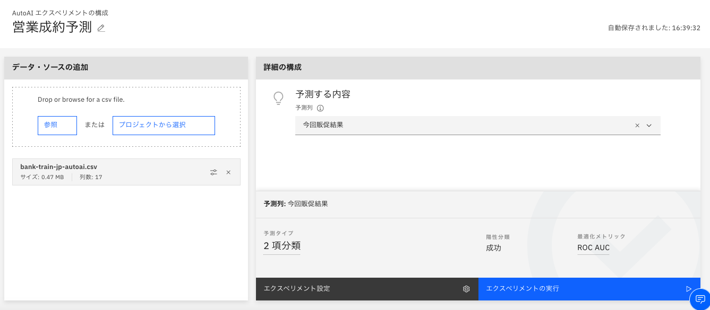

# 正誤訂正

#### 第1版第1-2刷
|章  |ページ  |内容　　　　　　　|補足|最終更新日|
|---|---|---|---|---|
|2章|p.21|下から6行目 (誤)教師なし学習と教師なし学習 (正)教師あり学習と教師なし学習||2029-12-21|
|6章|p.329|上から2行目 (誤)bank-autoai.ipynb (正)c31\_bank\_autoai\_data.ipynb||2020-12-21|
|6章|p.329|上から3行目 (誤)bank-autoai.csv (正)bank-train-jp-autoai.csv||2020-12-21|
|6章|p.329|図6-1を以下に差し替え ||2020-12-21|
|6章|p.329|図6-2を以下に差し替え ||2020-12-21|

[メインページに戻る](../README.md)

