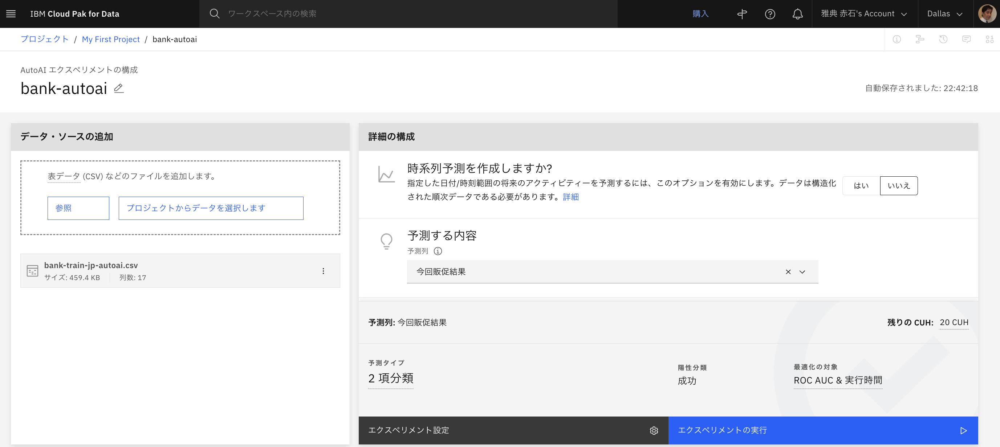
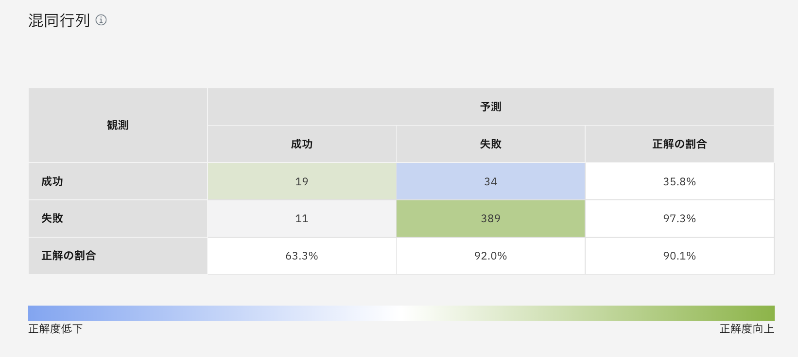
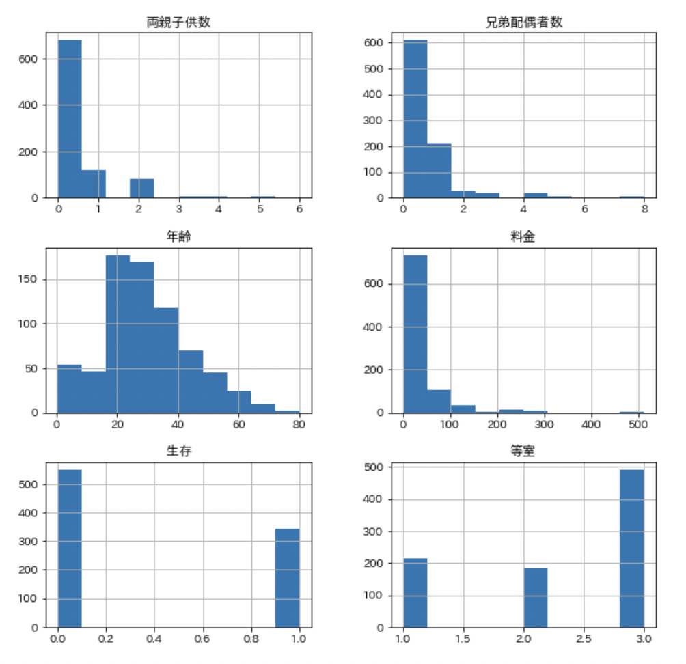
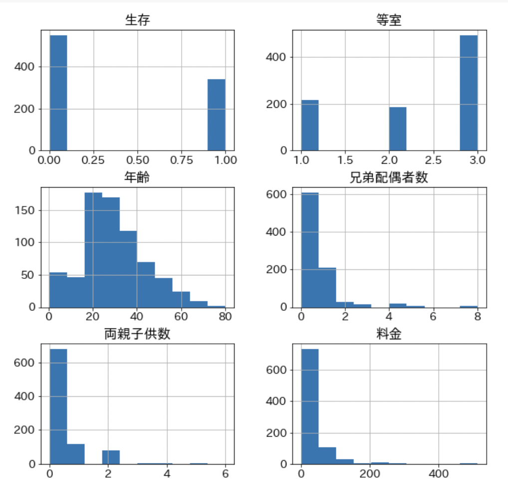
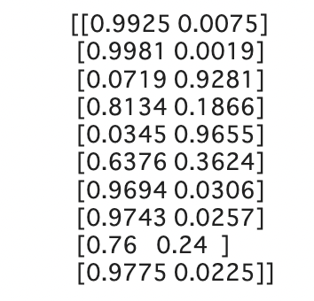
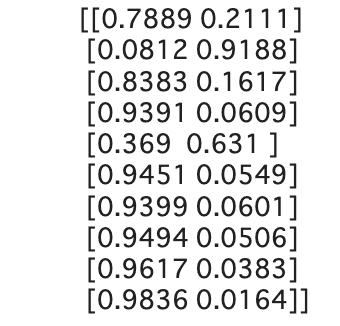
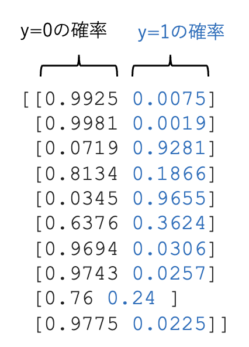
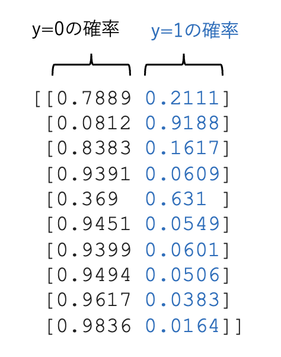
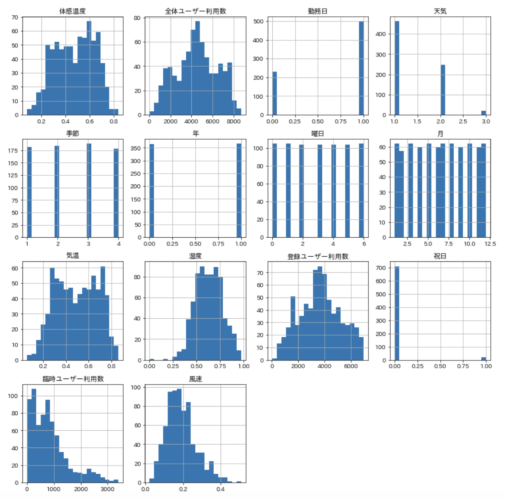
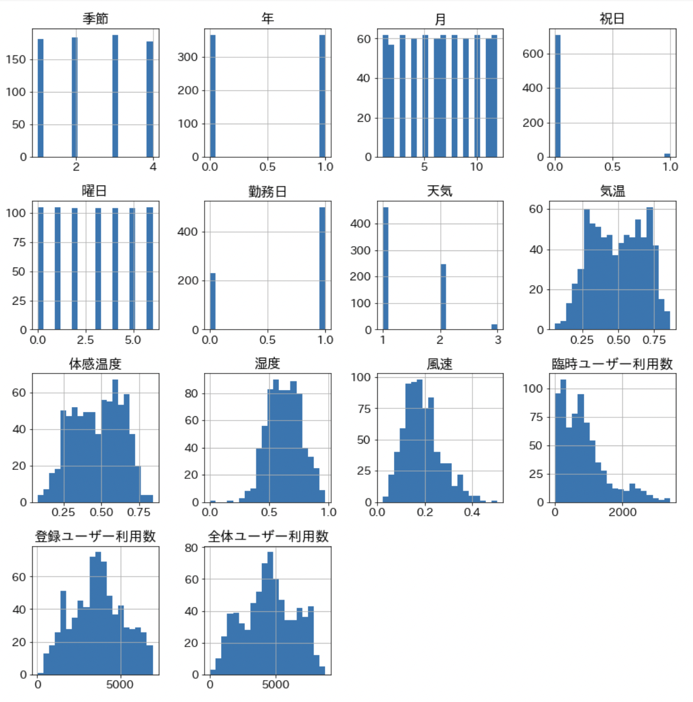

# 正誤訂正

#### 第1版第1-2刷
|章  |ページ  |内容　　　　　　　|補足|最終更新日|
|---|---|---|---|---|
|2章|p.21|下から6行目 (誤)教師なし学習と教師なし学習 (正)教師あり学習と教師なし学習||2020-12-21|
|6章|p.329|上から2行目 (誤)bank-autoai.ipynb (正)c31\_bank\_autoai\_data.ipynb||2020-12-21|
|6章|p.329|上から3行目 (誤)bank-autoai.csv (正)bank-train-jp-autoai.csv||2020-12-21|
|6章|p.329|図6-1を以下に差し替え   ||2020-12-21|
|6章|p.329|図6-2を以下に差し替え   ||2020-12-21|

#### 第1版第1-3刷
|章  |ページ  |内容　　　　　　　|補足|最終更新日|
|---|---|---|---|---|
|4章|p.77|コード4-1-6の図    (出版時)    (現在) |Google Colab上のライブラリバージョンアップで表示結果が変わりました。(グラフの表示順が項目順とそろって見やすくなっています)|2022-02-25|
|4章|p.96|コード4-2-4 最終行   (出版時) ``df6 = df5.replace({'デッキ': {np.nan: 'N'}})``   (修正後)  ``df5['デッキ'] = df5['デッキ'].astype(object); df6 = df5.fillna({'デッキ': 'N'})`` |Google Colab上のライブラリバージョンアップで動かなくなったことへの対応(replace関数が使えなくなったのでp.96脚注で解説しているのとほぼ同じ方法を用いています)|2022-02-25|
|4章|p.151|コード4-4-7 上から3行目以降   (誤)   ``print(y_proba[:10,:])`` 
    (正)   ``print(y_proba[10:20,:])`` 
 ||2022-02-25|
|4章|p.152|図4-4-4    (誤)       (正)    ||2022-02-23|
|5章|p.194|表5-1 上から4行目   (誤)Prospect (正)Prophet||2022-02-25|
|5章|p.213|下から2行目   (誤)y=0 (正)y=1||2021-06-13|
|5章|p.213|下から1行目   (誤)y_proba0 (正)y_proba1||2021-06-13|
|5章|p.214|上から2行目、3行目   (誤)y_proba0 (正)y_proba1||2021-06-13|
|5章|p.232|下から2行目   (出版時)``df.hist(bins=50)``   (現在)``df.hist(bins=20, column=columns[1:])``|Google Colab上のライブラリバージョンアップで日付列も表示されるようになったことへの対応でコードを修正|2022-02-25|
|5章|p.232|コード5-2-6の図    (出版時)    (現在) |Google Colab上のライブラリバージョンアップで表示結果が変わりました。(グラフの表示順が項目順とそろって見やすくなっています)|2022-02-25|

[メインページに戻る](../README.md)

